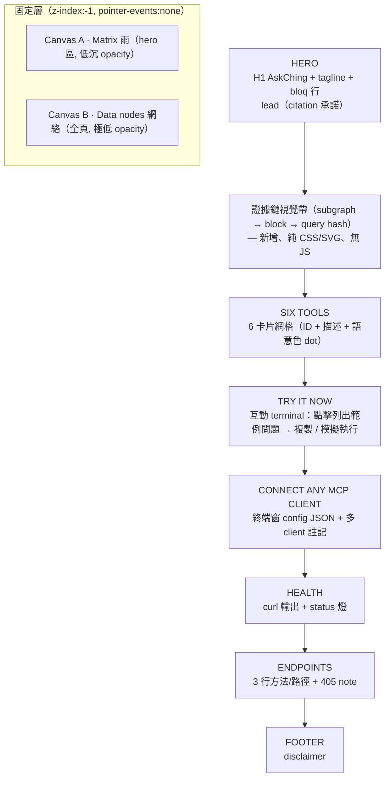

# AskChing Landing Page 科幻重設計 — 設計規格

- **日期**：2026-09-13
- **範圍**：單一檔案 `public/index.html` 重設計（無 build step、無外部 CDN/fonts、dark 主題、performance-first）
- **風格**：科幻 + Matrix + Web3 + The Graph
- **角色**：edison-ui-designer（Maker 執行產物，待 UI Reviewer 送審）

---

## 0. 搜尋資料來源（ui-ux-pro-max，本地設計資料庫）

| Query                                    | Domain                | 結果                                                                                                           | 用途                                                                        |
| ---------------------------------------- | --------------------- | -------------------------------------------------------------------------------------------------------------- | --------------------------------------------------------------------------- |
| `cyberpunk matrix sci-fi dark crypto`    | `--design-system`     | **HUD / Sci-Fi FUI**（Immersive/Interactive Experience pattern）                                               | 整體骨架：主色板、卡、HUD 氛圍、pre-delivery checklist                      |
| `matrix digital rain neon glow terminal` | `--domain style`      | **cyberpunk-ui**（#00FF00 / #FF00FF / #00FFFF / #0D0D0D）、**retro-futurism**、**dark-mode-oled**              | Matrix 色板、scanlines / glitch / neon glow 效果、implementation checklist  |
| `web3 crypto blockchain landing page`    | `--domain web`        | **0 結果（兩次重試）** — 資料庫無 landing 模式，**無 verified match**                                          | 依 adapter 規則改採 general guidance：沉浸式 hero + 任務導向 CTA + 細線繪製 |
| `sci-fi display terminal mono pairing`   | `--domain typography` | **Terminal CLI Monospace**（JetBrains Mono 單家族）、**Cyberpunk Mobile**（Orbitron + JetBrains Mono）         | 字體策略：monospace-only；無 CDN 限制下以系統 mono 實作                     |
| `degen crypto neon terminal green`       | `--domain color`      | **Coding Bootcamp — "Terminal dark + success green"**（#020617 / #22C55E）、**Fintech/Crypto — gold + purple** | 綠色 terminal 色板對照、對比度驗證基準                                      |

### 合成後的方向決策

- **基底**：HUD / Sci-Fi FUI（immersive dark）+ cyberpunk-ui 的 matrix 綠 accent
- **關鍵修正（相對純 cyberpunk）**：HUD 風格標註 `accessibility: risk:high | requires: contrast-text-4.5`，因此**主文字不用純 matrix 綠**，改採高對比的淺綠白；純 綠/青/洋紅 僅限 accent 與資料視覺元素
- **字體**：配合「無外部 CDN」限制，不載入 Orbitron/JetBrains Mono；採用 Terminal CLI Monospace 的 **single-monospace 紀律**，用系統 `ui-monospace` 堆疊達成同等氛圍

---

## 1. 設計方向決策

### 1.1 色板（近黑末端背景 + 調和 matrix 綠）

純 `#00FF00` 對黑的對比極高（≈15.9:1）但長時間閱讀刺眼；改用**調和的 matrix 綠家族**，保留終端機氛圍同時滿足 WCAG。

```css
:root {
  color-scheme: dark;

  /* 基底（帶藍綠的近黑，避免死黑） */
  --bg: #05070a; /* 頁面背景 */
  --bg-deep: #020304; /* 終端窗 / 最深層 */
  --panel: #0a100e; /* 卡片，帶綠調 */
  --panel-2: #0d1713; /* 卡片 hover / 輸入區 */
  --border: #1d2b24; /* 細網格線 */
  --border-glow: #1f8a5a; /* 聚焦 / hover 邊框的光 */

  /* 文字（對比度 ≥ 4.5:1，主文 ≥ 7:1） */
  --text: #dcf3e5; /* 主文字 vs --bg ≈ 15:1 */
  --muted: #8aa79a; /* 次要文字 vs --bg ≈ 6.9:1 */
  --faint: #5c7368; /* 極弱標籤（僅限非必要資訊） */

  /* Matrix 綠家族（調和版） */
  --green: #3df59a; /* 主 accent，大標/連結/成功 */
  --green-dim: #21b977; /* 靜態 code / 次要 */
  --green-faint: #0f4a33; /* 大面積底光、rain 暗流（不可做文字色） */

  /* 次 accent（資料/協議語意色） */
  --cyan: #35d6ff; /* The Graph 資料節點、鏈接、subgraph id */
  --magenta: #ff5aa0; /* 風險、警示、">" 輸入 prompt（小面積） */
  --warn: #ffc857; /* 既有 warn（cannot cite 之拒答語意） */
  --red: #ff6b6b; /* 405 / 錯誤輸出 */
}
```

**對比度驗證（APCA 精神 / WCAG 2.2）**：

| 使用            | 前景      | 背景      | 對比   | 通過   |
| --------------- | --------- | --------- | ------ | ------ |
| body 主文字     | `#dcf3e5` | `#05070a` | ≈15:1  | ✅ AAA |
| muted 文字      | `#8aa79a` | `#05070a` | ≈6.9:1 | ✅ AAA |
| 綠連結 / code   | `#3df59a` | `#05070a` | ≈11:1  | ✅ AAA |
| 綠 code（較小） | `#21b977` | `#0a100e` | ≈7.5:1 | ✅ AAA |
| cyan 資料元素   | `#35d6ff` | `#05070a` | ≈10:1  | ✅ AAA |
| magenta prompt  | `#ff5aa0` | `#0a100e` | ≈6:1   | ✅ AA  |
| panel 內 muted  | `#8aa79a` | `#0a100e` | ≈5.8:1 | ✅ AA  |

> 規則：`--green-faint` / `--bg-deep` 對比僅 ~1.8:1，**只能**當背景光暈或動畫裝飾，禁止承載文字。

### 1.2 字體策略（無 CDN 的 Terminal Mono 紀律）

- **單一 monospace 家族**：`ui-monospace, "SF Mono", SFMono-Regular, Menlo, Consolas, monospace` — 對齊 Terminal CLI Monospace pairing「只用 mono、14px、字距正常」。
- **大小階梯**：H1 56px（僅文字 logo）/ body 16px / code 14px / 標籤 11px（uppercase、letter-spacing .18em）。
- 品牌感由**字距 + glow + 大小**達成，不靠載入科幻 display font：
  - H1：`font-weight 700`、`letter-spacing: .06em`、弱綠 glow（`text-shadow: 0 0 24px rgba(61,245,154,.35)`）。
  - 小標籤：`11px/1 uppercase`, `color: var(--muted)`、前面加 `▜` 或 `//` 終端註記。

### 1.3 視覺元素清單（對應 HUD checklist）

| 元素              | 用途                | 實作                                                   |
| ----------------- | ------------------- | ------------------------------------------------------ |
| Matrix 數位雨     | 沉浸背景（hero 區） | Canvas A（見 §3）                                      |
| Data nodes 網絡   | The Graph 語意背景  | Canvas B（見 §4）                                      |
| Scanlines overlay | CRT 深度            | `body::after` repeating-linear-gradient，opacity ≤ .05 |
| Vignette          | 聚焦中央內容        | `body::before` radial-gradient                         |
| 角標 / 切角       | HUD 技術感          | `clip-path: polygon(...)` 於卡片角                     |
| `▮` blink cursor  | Terminal 互動       | `@keyframes blink` + `prefers-reduced-motion` 關閉     |
| Glitch（極輕量）  | H1 一瞬             | 僅 hover 或 2s 一次 60ms skew，避免閱讀干擾            |
| Block height 標籤 | 每個 section 前     | 如 `BLK 21,784,325 · SUBGRAPH 0x…` 靜態文案 + `--cyan` |

---

## 2. 版面架構（保留全部既有 sections）



- 單欄 max-width 64rem，Hero 容許更寬（78rem）以凸顯 data nodes。
- 每個 section 前一行 HUD 標籤：`▚ SECTION 0x03 · SIX TOOLS`，維持進度感。

---

## 3. Matrix 數位雨實作建議（純 JS Canvas，無依賴）

**設計決策**：hero 區 `position: relative` 內放**固定定位** canvas（`position:fixed; inset:0; z-index:-1`），雨只在上半部渲染、下半部透明度遞減，避免干擾內容閱讀（Deference）。

```js
// 概念片段 — 單一 canvas、column-based、效能優先
const rain = (() => {
  const canvas = document.getElementById('rain');
  const ctx = canvas.getContext('2d');
  const GREEN = 'rgba(61,245,154,'; // 調和綠，非純 00FF00
  let cols = 0,
    drops = [],
    fs = 14;

  function resize() {
    const { devicePixelRatio: dpr } = window;
    canvas.width = innerWidth * dpr;
    canvas.height = innerHeight * dpr;
    ctx.setTransform(dpr, 0, 0, dpr, 0, 0);
    canvas.style.width = innerWidth + 'px';
    canvas.style.height = innerHeight + 'px';
    cols = Math.ceil(innerWidth / fs);
    drops = Array.from({ length: cols }, () => Math.random() * -100);
  }

  function tick() {
    ctx.fillStyle = 'rgba(5,7,10,0.08)'; // 拖尾殘影（非全清除，成本低）
    ctx.fillRect(0, 0, innerWidth, innerHeight);
    ctx.font = fs + 'px ui-monospace, Menlo, monospace';
    for (let i = 0; i < cols; i++) {
      const ch = String.fromCharCode(0x30a0 + Math.random() * 96); // katakana 感
      const x = i * fs,
        y = drops[i] * fs;
      ctx.fillStyle = GREEN + (y / innerHeight).toFixed(2) + ')'; // 越底越淡
      ctx.fillText(ch, x, y);
      if (y > innerHeight && Math.random() > 0.975) drops[i] = 0;
      drops[i]++;
    }
    requestAnimationFrame(tick);
  }

  resize();
  addEventListener('resize', resize);
  return { tick };
})();

// 啟動（可在 DOMContentLoaded 後）
// if (!matchMedia('(prefers-reduced-motion: reduce)').matches) rain.tick();
// else 繪製單一靜止幀（淺影裝飾）即可
```

**效能與可及性規則**：

- `prefers-reduced-motion: reduce` → 不啟動 rAF，只畫 1–2 幀靜止暗影（綠色 opacity ≤ 0.15）。
- `document.hidden` / `IntersectionObserver`（hero 離開視窗）→ 暫停 rAF。
- 每幀只 `fillText`（無 shadowBlur — shadowBlur 是 canvas 效能殺手）；glow 由 CSS 在**靜態元素**上做。
- 雨區掃描線 opacity 壓在 0.04，紅/綠殘像閃爍控制在最小（避免光敏性風險）。

---

## 4. Web3 + The Graph 元素（evidence chain 視覺化）

### 4.1 Data nodes 背景（Canvas B）

- 固定層第二個 canvas：12–18 個節點（隨機位置，彼此距離 < 160px 才連線，線 opacity 依距離衰減）。
- 節點為 2–3px 圓點（`--cyan`），連線為 1px（`rgba(53,214,255,.25)`）。
- 每 2–3s 一個節點「脈衝」：半徑 3→10px 的擴散圓（opacity 同步衰減）— 暗示 **subgraph 同步 / 區塊新增**。
- 一律 `prefers-reduced-motion` 時靜止。

### 4.2 Evidence chain 橫帶（新增，位於 lead 之後）

「每一個數字都有 provenance」是核心價值 — 用一條**純 CSS/SVG** 證據鏈直接視覺化：

```
[SUBGRAPH NODE] ──query──► [BLOCK █ 高度] ──hash──► [CITATION]
   Aave V3 0x9c…          #21,784,325            0x4f3a…e2 (verified ✓)
```

- 三節點以 inline SVG（`<svg>` 內嵌，無外檔）手繪：圓形節點 + 帶箭頭線段 + 點狀動畫（`stroke-dashoffset`）。
- 節點內容是**真實格式**：subgraph ID（`0x9c…` 截斷）、block number（`21,784,325`）、query hash（`sha256 → 0x4f3a…e2`）— 讓 reviewer 一眼看懂格式。
- 顏色語意：subgraph = `--cyan`，block = `--green`，hash = `--magenta`；第三節點加 `✓ verified`（`--green`）。
- 下緣 caption：`EVIDENCE CHAIN — every figure carries subgraph id · block · query hash，or AskChing fails closed`.

### 4.3 Terminal 輸出語言的統一

- 所有 `code` / `pre` 加 `data-prompt` 風格：區塊前一行 `$` 或 `>`（muted），輸出綠色。
- Try it now 改為「terminal 會話」視覺：輸入行 `> compare_markets …`（magenta prompt + 綠字），下方回應行含 `SOURCE 1/2` 標記，呼應「少於 2 個來源拒絕回答」。第一組範例問題後附一行 `✕ REFUSED — only 1 source cited`（`--warn`），把 fail-closed 也做成可見的 design pattern。

---

## 5. 保持內容完整（sections 對照）

| 既有 section           | 重設計後                                 | 內容差異                                                                                      |
| ---------------------- | ---------------------------------------- | --------------------------------------------------------------------------------------------- |
| H1 + tagline + lead    | Hero（rain 背景）+ 證據鏈帶              | 文案**原封不動**（含 "If it cannot cite at least two sources, it refuses to answer." 加粗）   |
| Six tools              | 6-卡網格（2 欄，mobile 1 欄）            | 每卡：`tool_id`（綠）、描述（muted）、語意色 dot（compare=cyan, trends=green, risk=magenta…） |
| Try it now             | 互動 terminal 窗                         | 3 個範例問題全部保留 + 拒答範例行保留；新增一鍵複製                                           |
| Connect any MCP client | 終端窗 config JSON + tabs 式 client 註記 | JSON 內容不變；VS Code/Codex/Gemini/stdio 註記全部保留                                        |
| Health                 | curl + 即時 status 燈                    | curl 內容不變；`"live":true` 以綠燈 + 呼吸效果呈現                                            |
| Endpoints              | 3 行 method/path 表格化                  | 3 個端點 + 405 note 全部保留                                                                  |
| footer                 | 保留 disclaimer 全文                     | 加 1px 上邊框 + faint 色                                                                      |

---

## 6. 可及性（WCAG 2.2）

| 項目           | 做法                                                                                                       |
| -------------- | ---------------------------------------------------------------------------------------------------------- |
| 對比度         | 見 §1.1 表 — 主文 AAA、次要 AA，禁用 `--green-faint` 承載文字                                              |
| 鍵盤           | `:focus-visible` 2px `--green` 外框 + 1px 內部 dark gap；所有互動元素（copy 按鈕）是可 focus 的 `<button>` |
| Reduced motion | 單一 media query 關閉 rain / nodes / blink / 脈衝 / glitch；靜止裝飾以低 opacity 保留                      |
| 光敏性         | 掃描線 ≤0.05、無大面積紅閃爍、glitch 僅 hover 才觸發                                                       |
| 語意           | `<main>`、section 標題 `<h1>…<h2>` 階層不變；新增元素不加非語意 div 海                                     |
| 字體           | body ≥16px；code 14px 以上；`pre` 水平捲動保留                                                             |
| 鍵盤複製       | copy 按鈕用 `<button aria-label="Copy config">`，成功時 `aria-live="polite"` 輸出 "copied"                 |
| 游標           | blink cursor 用 `opacity` 動畫而非 `display:none`（AT 不會誤讀）                                           |

**鍵盤動畫守則**：所有「持續閃爍」元素（cursor、status 燈）在 `prefers-reduced-motion` 下轉為靜態高亮而非閃爍。

---

## 7. 實作注意 / 邊界

- **單一檔案**：全部 CSS 進 `<style>`；兩個 canvas + 複製 + 脈衝全部進一個 `<script>`（無 `defer` 問題 — script 放 body 尾）。
- **效能**：不引入任何 framework / lib；canvas 僅用 `fillStyle/fillRect/fillText`，不用 shadowBlur；雨與 nodes 共用 rAF（單一 loop、單一 `requestAnimationFrame` 驅動兩個畫布 + 脈衝時序）。
- **互動極簡**：唯一 JS 互動 = 複製按鈕 + 按下時 terminal 暫時顯示 `> (copied)`；不做打字機動畫（成本/收益不合）。
- **送審**：本規格完成後，實作產物送 `edison-ui-ux-hostile-review` 驗收（Maker ≠ Checker）。

---

## 附錄 A — 未驗證資料標註（依 adapter 規則）

`--domain web`「Web3 / blockchain landing page 模式」查詢兩次（`web3 crypto blockchain landing page` / `landing page product hero`）於 `app-interface.csv` 均 **0 結果** — 無 verified match。改用 **general guidance**（源自 HUD/Sci-Fi FUI design system 的 Immersive/Interactive pattern）：沉浸式 hero → 引導瀏覽 → 收益揭露 → CTA；並加上 `skip option + reduced-motion fallback + 非 3D 替代路徑`（本規格 §3/§4/§6 已落實）。

## 附錄 B — 實作時可直接套用的 keyframe / snippet

```css
/* scanlines + vignette（body::before/::after） */
body::after {
  content: '';
  position: fixed;
  inset: 0;
  z-index: 0;
  pointer-events: none;
  background: repeating-linear-gradient(
    0deg,
    rgba(255, 255, 255, 0.025) 0 1px,
    transparent 1px 3px
  );
}

/* blink cursor（reduced-motion 下靜態） */
@keyframes blink {
  0%,
  55% {
    opacity: 1;
  }
  56%,
  100% {
    opacity: 0;
  }
}
.cursor {
  animation: blink 1.1s steps(1) infinite;
}
@media (prefers-reduced-motion: reduce) {
  .cursor {
    animation: none;
    opacity: 0.8;
  }
}

/* HUD corner clip */
.corner {
  clip-path: polygon(
    0 0,
    calc(100% - 14px) 0,
    100% 14px,
    100% 100%,
    14px 100%,
    0 calc(100% - 14px)
  );
}

/* neon text（僅 H1 與 section 標籤） */
.glow-green {
  text-shadow:
    0 0 18px rgba(61, 245, 154, 0.4),
    0 0 2px rgba(61, 245, 154, 0.6);
}
```
