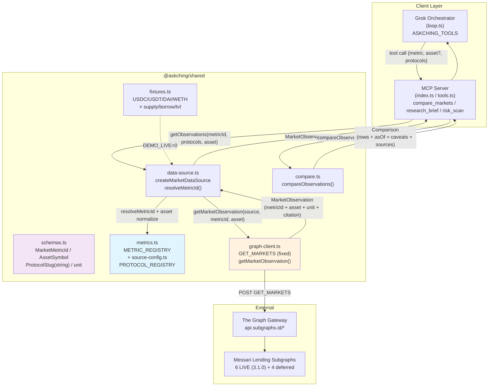
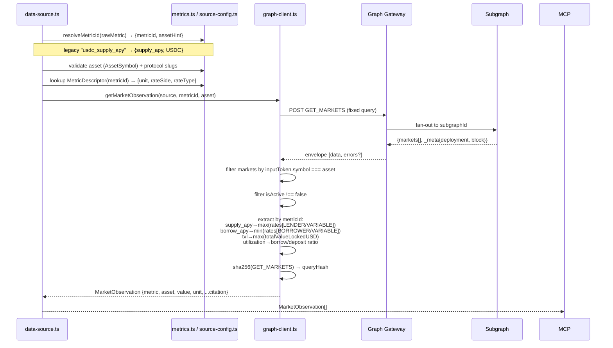
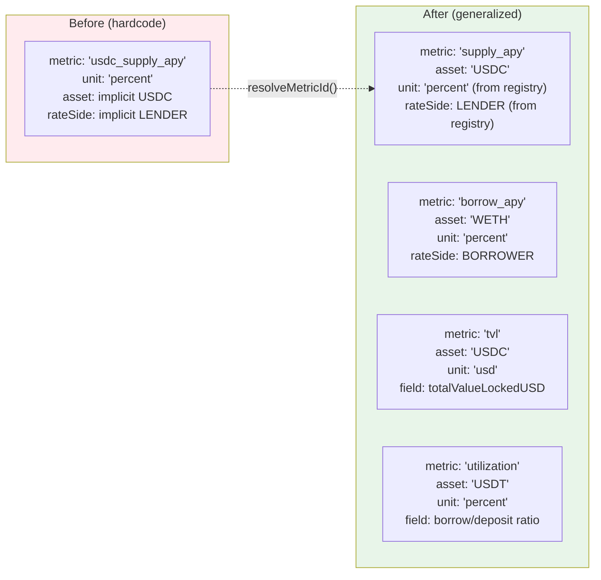
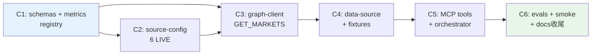

# AskChing 泛化查詢系統技術方案（Generalize Query System）

> 版本: v0.2.0 規劃｜建立日期: 2026-09-10｜狀態: 待審核（Awaiting Review）
> Depth: L3 Deep Dive｜Quality Mode: strict（threshold 93）｜規劃員: architect（規劃部）
> 對應分支: `feat/generalize-query-system`｜前置依賴: `main` @ 2026-09-09 idea-completion-audit 完成

---

## 0. 文件導讀與已定架構決策

本方案將 AskChing 從 **USDC-only / 單一 metric / 3 協議 hardcode** 泛化為 **動態多資產 × 多 metric × 多協議** 的可擴展查詢系統。所有設計以「最小可用泛化 + 向後相容 + fail-closed 引用」為約束。

### 0.1 已定架構決策（Must Obey，不可推翻）

| # | 決策 | 內涵 | 影響檔案 |
|---|------|------|----------|
| D1 | Metric 拆維 | `"usdc_supply_apy"` → `metric_id`（`"supply_apy"`）+ `asset`（`"USDC"`） | `schemas.ts`, `data-source.ts`, `tools.ts`, `loop.ts` |
| D2 | METRIC_REGISTRY 新 module | `supply_apy / borrow_apy / tvl / utilization` 四 metric + legacy alias `usdc_supply_apy → supply_apy` | `metrics.ts`（新增） |
| D3 | ProtocolSchema 泛化 | `z.enum([...])` → `z.string()` + registry 驗證 | `schemas.ts`, `source-config.ts` |
| D4 | unit 泛化 | `z.literal("percent")` → `z.enum(["percent","usd"])` | `schemas.ts`, `metrics.ts` |
| D5 | GET_MARKETS 固定 query | 單一 `GET_MARKETS` query（含 3.1.0 欄位）+ code 層過濾，不依 metric 切 query | `graph-client.ts` |
| D6 | Protocol registry 擴展 | 3 → 6+ live protocols（僅用已驗證 subgraph ID） | `source-config.ts` |
| D7 | MCP tools 增加 asset 參數 | `asset` optional，預設 `USDC`，向後相容 | `tools.ts`, `loop.ts` |
| D8 | 6 commits 分階段交付 | 見 §10 | 全量 |

### 0.2 術語表

| 術語 | 定義 |
|------|------|
| `MarketMetricId` | 泛化後 metric 識別符（不含資產），如 `supply_apy` |
| `AssetSymbol` | 資產符號，如 `USDC` / `USDT` / `DAI` / `WETH`，正規化為大寫 |
| `ProtocolSlug` | 協議 slug，如 `aave-v3`，由 registry 驗證而非 enum 窮舉 |
| `MetricDescriptor` | registry 中單一 metric 的完整描述（含 unit、rateSide、rateType、extractor） |
| `MarketObservation` | 單一協議 × 單一資產 × 單一 metric 的帶引用觀測值 |

---

## 1. 目標與非目標

### 1.1 目標（Goals）

| G# | 目標 | 驗收信號 |
|----|------|----------|
| G1 | **多資產**：支援 USDC / USDT / DAI / WETH 四資產的查詢與比較 | `getObservations("supply_apy", ["aave-v3","compound-v3"], "USDC")` 與 `"WETH"` 皆可回傳正確引用 |
| G2 | **多 metric**：支援 `supply_apy / borrow_apy / tvl / utilization` 四 metric | 每個 metric 有獨立 unit、extraction 邏輯與 fixture 覆蓋 |
| G3 | **多協議**：LIVE 協議從 3 擴至 6+（首批 6 個 3.1.0 schema） | `LIVE_SOURCES.length >= 6`，且每個皆通過 live-smoke |
| G4 | **向後相容**：既有 `usdc_supply_apy` 呼叫不中斷 | `resolveMetricId("usdc_supply_apy") → { metricId: "supply_apy", asset: "USDC" }` 且舊 evals 全綠 |
| G5 | **引用完整性不退化**：泛化後仍維持 `subgraphId + block + timestamp + queryHash` fail-closed | 任何缺引用欄位即拋錯，不回傳半成品 |
| G6 | **固定 query 策略**：單一 `GET_MARKETS` query 覆蓋所有 metric/asset 組合 | `graph-client.ts` 僅一個 query 字串常數 |

### 1.2 非目標（Non-Goals）

| NG# | 非目標 | 理由 |
|-----|--------|------|
| NG1 | 不做歷史時序（time-series / 24h avg） | 現有 caveat 已明示 spot-only；時序需另案設計索引策略 |
| NG2 | 不做非 EVM 鏈（Base / Arbitrum 等） | 本次僅 Ethereum mainnet；跨鏈為後續 phase |
| NG3 | 不做價格預言機整合 | `tvl` 以 subgraph 回傳 USD 為準，不另接 price feed |
| NG4 | 不啟用 2.0.1 / 1.3.0 schema 的 4 個協議為 LIVE | `compound-v2 / rari-fuse / makerdao / euler` 僅進 registry（`live: false`），待欄位級驗證後再啟用 |
| NG5 | 不改 `compareObservations` 排序語意 | 仍以 `value` 降冪排序；跨 metric 比較由上層 guard 拒絕 |

### 1.3 成功指標（Success Criteria）

- `pnpm test` 26 → 40+ tests 全綠（含新增 14+）
- `pnpm eval` 10 cases 全綠 + 新增 6 泛化 cases 全綠
- `pnpm live:smoke` 對 6 個 LIVE 協議皆可取得帶引用觀測值（DEMO_LIVE=1）
- 舊呼叫 `compare_markets({ metric: "usdc_supply_apy", protocols: [...] })` 仍通過（backward-compat）

---

## 2. 架構圖（泛化 Data Flow）

### 2.1 系統全景（泛化後）



### 2.2 單次觀測提取序列



### 2.3 Metric 拆維示意



---

## 3. Schema 設計草案（新的 `schemas.ts`）

> **可直接 copy 給開發者**。本草案為完整檔案替換，非 patch。

### 3.1 設計要點

| 要點 | 決策 | 理由 |
|------|------|------|
| `MarketMetricId` | `z.enum(["supply_apy","borrow_apy","tvl","utilization"])` | 與 `METRIC_REGISTRY` keys 單一真相來源對齊 |
| `AssetSymbol` | `z.string().regex(/^[A-Z0-9]{2,10}$/)` + 正規化 `toUpperCase()` | 支援 USDC/USDT/DAI/WETH，拒絕任意字串注入 |
| `ProtocolSlug` | `z.string().min(1)` + registry 驗證 | D3：enum → string，避免每新增協議改 schema |
| `unit` | `z.enum(["percent","usd"])` | D4：apy/utilization→percent，tvl→usd |
| `MarketObservation` | 新增 `asset: AssetSymbol` 欄位，`metric` 改為 `MarketMetricId` | D1 拆維落地 |
| Legacy 相容 | `LegacyMetricAliasSchema` 僅在 `resolveMetricId` 邊界處理，不污染 `MarketMetricId` enum | 單一真相來源原則 |

### 3.2 完整 `packages/shared/src/schemas.ts` 草案

```typescript
import { z } from "zod";

// ── Metric ──────────────────────────────────────────────────────────
export const MarketMetricIdSchema = z.enum([
  "supply_apy",
  "borrow_apy",
  "tvl",
  "utilization",
]);
export type MarketMetricId = z.infer<typeof MarketMetricIdSchema>;

/** @deprecated 僅用於 backward-compat 邊界正規化，請用 MarketMetricId + asset */
export const LegacyMetricAliasSchema = z.enum(["usdc_supply_apy"]);
export type LegacyMetricAlias = z.infer<typeof LegacyMetricAliasSchema>;

// ── Asset ───────────────────────────────────────────────────────────
export const AssetSymbolSchema = z
  .string()
  .regex(/^[A-Z0-9]{2,10}$/, "Asset symbol must be 2-10 uppercase alphanumerics")
  .describe("Normalized asset symbol, e.g. USDC, USDT, DAI, WETH");
export type AssetSymbol = z.infer<typeof AssetSymbolSchema>;

// ── Protocol ────────────────────────────────────────────────────────
// D3: enum → string，驗證由 PROTOCOL_REGISTRY 負責
export const ProtocolSchema = z.string().min(1).describe("Protocol slug validated against PROTOCOL_REGISTRY");
export type ProtocolSlug = z.infer<typeof ProtocolSchema>;

// ── Unit ────────────────────────────────────────────────────────────
export const UnitSchema = z.enum(["percent", "usd"]);
export type Unit = z.infer<typeof UnitSchema>;

// ── Rate Type ───────────────────────────────────────────────────────
export const RateTypeSchema = z.enum(["variable", "stable", "fixed"]);
export type RateType = z.infer<typeof RateTypeSchema>;

// ── Citation ────────────────────────────────────────────────────────
export const CitationSchema = z.object({
  value: z.number().finite(),
  unit: UnitSchema,
  protocol: ProtocolSchema,
  asset: AssetSymbolSchema,
  subgraphId: z.string().min(1),
  deploymentId: z.string().min(1).optional(),
  block: z.number().int().nonnegative().optional(),
  timestamp: z.string().datetime(),
  queryHash: z.string().min(1),
});
export type Citation = z.infer<typeof CitationSchema>;

// ── MarketObservation ───────────────────────────────────────────────
export const MarketObservationSchema = CitationSchema.extend({
  metric: MarketMetricIdSchema,
  rateType: RateTypeSchema.optional(),
  // rateType 僅對 supply_apy / borrow_apy 有意義；tvl / utilization 為 undefined
});
export type MarketObservation = z.infer<typeof MarketObservationSchema>;

// ── Comparison ──────────────────────────────────────────────────────
export const ComparisonRowSchema = MarketObservationSchema.extend({
  rank: z.number().int().positive(),
});

export const ComparisonSourceSchema = CitationSchema.pick({
  protocol: true,
  asset: true,
  subgraphId: true,
  deploymentId: true,
  block: true,
  timestamp: true,
  queryHash: true,
});

export const ComparisonSchema = z.object({
  metric: MarketMetricIdSchema,
  asset: AssetSymbolSchema,
  asOf: z.string().datetime(),
  rows: z.array(ComparisonRowSchema).min(2),
  caveats: z.array(z.string()),
  sources: z.array(ComparisonSourceSchema).min(2),
});
export type Comparison = z.infer<typeof ComparisonSchema>;

// ── Backward-compat helpers ─────────────────────────────────────────
/** 舊 Comparison（無 asset 欄位）的寬鬆解析，用於讀取舊快照 */
export const LegacyComparisonSchema = z.object({
  metric: z.union([MarketMetricIdSchema, LegacyMetricAliasSchema]),
  asOf: z.string().datetime(),
  rows: z.array(ComparisonRowSchema.omit({ asset: true }).extend({ asset: AssetSymbolSchema.optional() })).min(2),
  caveats: z.array(z.string()),
  sources: z.array(ComparisonSourceSchema.omit({ asset: true }).extend({ asset: AssetSymbolSchema.optional() })).min(2),
});
```

### 3.3 關鍵差異對照（Before → After）

| 欄位 | Before | After | 遷移策略 |
|------|--------|-------|----------|
| `MarketMetricSchema` | `z.enum(["usdc_supply_apy"])` | `MarketMetricIdSchema: z.enum(["supply_apy","borrow_apy","tvl","utilization"])` | `resolveMetricId()` 在 `data-source.ts` 邊界轉換 |
| `ProtocolSchema` | `z.enum(["aave-v3","compound-v3","spark-lend"])` | `z.string().min(1)` | `PROTOCOL_REGISTRY` 驗證，未知 slug 拋錯 |
| `Citation.unit` | `z.literal("percent")` | `UnitSchema: z.enum(["percent","usd"])` | 由 `MetricDescriptor.unit` 單向決定 |
| `Citation` | 無 `asset` | 新增 `asset: AssetSymbolSchema` | 所有新觀測必填；舊資料由 `resolveMetricId` 補 `USDC` |
| `MarketObservation.metric` | `MarketMetricSchema` | `MarketMetricIdSchema` | 同上 |
| `MarketObservation.rateType` | `z.literal("variable")` 必填 | `RateTypeSchema.optional()` | `tvl/utilization` 為 `undefined` |
| `Comparison` | 無 `asset` | 新增 `asset: AssetSymbolSchema` | 比較僅在同 asset 內有效，跨 asset 由上層 guard 拒絕 |

---

## 4. Registry 設計草案

### 4.1 `packages/shared/src/metrics.ts`（新增）

> **可直接 copy**。此為 D2 的核心新 module。

```typescript
import type { MarketMetricId, Unit } from "./schemas.js";

export type RateSide = "LENDER" | "BORROWER";
export type RateTypeFilter = "VARIABLE" | "STABLE" | "FIXED";

export interface MetricDescriptor {
  id: MarketMetricId;
  label: string;
  unit: Unit;
  /** 僅 apy 類 metric 有 rate 過濾條件 */
  rateSide?: RateSide;
  rateType?: RateTypeFilter;
  /** 用於 graph-client 選擇提取欄位 */
  extractor: "rates" | "tvl" | "utilization";
  description: string;
}

export const METRIC_REGISTRY: Record<MarketMetricId, MetricDescriptor> = {
  supply_apy: {
    id: "supply_apy",
    label: "Supply APY",
    unit: "percent",
    rateSide: "LENDER",
    rateType: "VARIABLE",
    extractor: "rates",
    description: "Variable supply APY for the given asset (best market rate)",
  },
  borrow_apy: {
    id: "borrow_apy",
    label: "Borrow APY",
    unit: "percent",
    rateSide: "BORROWER",
    rateType: "VARIABLE",
    extractor: "rates",
    description: "Variable borrow APY for the given asset (best market rate)",
  },
  tvl: {
    id: "tvl",
    label: "Total Value Locked",
    unit: "usd",
    extractor: "tvl",
    description: "Total value locked (USD) for the given asset market",
  },
  utilization: {
    id: "utilization",
    label: "Utilization Rate",
    unit: "percent",
    extractor: "utilization",
    description: "Borrow / deposit utilization ratio for the given asset market",
  },
} as const;

// ── Legacy alias（D2）───────────────────────────────────────────────
export const LEGACY_METRIC_ALIASES: Record<string, { metricId: MarketMetricId; asset: string }> = {
  usdc_supply_apy: { metricId: "supply_apy", asset: "USDC" },
} as const;

export function resolveMetricId(
  raw: string
): { metricId: MarketMetricId; assetHint?: string } {
  const lower = raw.toLowerCase();
  if (lower in LEGACY_METRIC_ALIASES) {
    const aliased = LEGACY_METRIC_ALIASES[lower]!;
    return { metricId: aliased.metricId, assetHint: aliased.asset };
  }
  if (raw in METRIC_REGISTRY) {
    return { metricId: raw as MarketMetricId };
  }
  throw new Error(
    `Unknown metric: ${raw}. Supported: ${Object.keys(METRIC_REGISTRY).join(", ")} (legacy: ${Object.keys(LEGACY_METRIC_ALIASES).join(", ")})`
  );
}

export function getMetricDescriptor(metricId: MarketMetricId): MetricDescriptor {
  const desc = METRIC_REGISTRY[metricId];
  if (!desc) throw new Error(`Unknown metric id: ${metricId}`);
  return desc;
}
```

### 4.2 `packages/shared/src/source-config.ts` 擴展草案

> **完整替換**。LIVE 6 個（全 3.1.0），deferred 4 個（`live: false`）。

```typescript
import type { ProtocolSlug } from "./schemas.js";
export type { ProtocolSlug } from "./schemas.js";

export interface SubgraphSource {
  protocol: ProtocolSlug;
  network: "mainnet";
  subgraphId: string;
  explorerUrl: string;
  schemaVersion: string;
  live: boolean;
}

export const PROTOCOL_REGISTRY: readonly SubgraphSource[] = [
  // ── LIVE (schema 3.1.0, verified) ──────────────────────────────
  {
    protocol: "aave-v3",
    network: "mainnet",
    subgraphId: "JCNWRypm7FYwV8fx5HhzZPSFaMxgkPuw4TnR3Gpi81zk",
    explorerUrl: "https://thegraph.com/explorer/subgraphs/JCNWRypm7FYwV8fx5HhzZPSFaMxgkPuw4TnR3Gpi81zk",
    schemaVersion: "3.1.0",
    live: true,
  },
  {
    protocol: "compound-v3",
    network: "mainnet",
    subgraphId: "AwoxEZbiWLvv6e3QdvdMZw4WDURdGbvPfHmZRc8Dpfz9",
    explorerUrl: "https://thegraph.com/explorer/subgraphs/AwoxEZbiWLvv6e3QdvdMZw4WDURdGbvPfHmZRc8Dpfz9",
    schemaVersion: "3.1.0",
    live: true,
  },
  {
    protocol: "spark-lend",
    network: "mainnet",
    subgraphId: "GbKdmBe4ycCYCQLQSjqGg6UHYoYfbyJyq5WrG35pv1si",
    explorerUrl: "https://thegraph.com/explorer/subgraphs/GbKdmBe4ycCYCQLQSjqGg6UHYoYfbyJyq5WrG35pv1si",
    schemaVersion: "3.1.0",
    live: true,
  },
  {
    protocol: "aave-v2",
    network: "mainnet",
    subgraphId: "C2zniPn45RnLDGzVeGZCx2Sw3GXrbc9gL4ZfL8B8Em2j",
    explorerUrl: "https://thegraph.com/explorer/subgraphs/C2zniPn45RnLDGzVeGZCx2Sw3GXrbc9gL4ZfL8B8Em2j",
    schemaVersion: "3.1.0",
    live: true,
  },
  {
    protocol: "uwu-lend",
    network: "mainnet",
    subgraphId: "CZBD7e8VGvNa6WkBHZAaC688bsZ35UvAM1AuDdVng2aE",
    explorerUrl: "https://thegraph.com/explorer/subgraphs/CZBD7e8VGvNa6WkBHZAaC688bsZ35UvAM1AuDdVng2aE",
    schemaVersion: "3.1.0",
    live: true,
  },
  {
    protocol: "zerolend",
    network: "mainnet",
    subgraphId: "4Zf4doH54RDit9KVsfCp3MkjrP3szhJZwvw2z5PHczx9",
    explorerUrl: "https://thegraph.com/explorer/subgraphs/4Zf4doH54RDit9KVsfCp3MkjrP3szhJZwvw2z5PHczx9",
    schemaVersion: "3.1.0",
    live: true,
  },
  // ── DEFERRED (需欄位級驗證後再啟用) ────────────────────────────
  {
    protocol: "compound-v2",
    network: "mainnet",
    subgraphId: "4TbqVA8p2DoBd5qDbPMwmDZv3CsJjWtxo8nVSqF2tA9a9a",
    explorerUrl: "https://thegraph.com/explorer/subgraphs/4TbqVA8p2DoBd5qDbPMwmDZv3CsJjWtxo8nVSqF2tA9a9a",
    schemaVersion: "2.0.1",
    live: false,
  },
  {
    protocol: "rari-fuse",
    network: "mainnet",
    subgraphId: "kecp6SPMvbB4GTqg9r5PXvztYriexj5F3ZCaATpjmb2",
    explorerUrl: "https://thegraph.com/explorer/subgraphs/kecp6SPMvbB4GTqg9r5PXvztYriexj5F3ZCaATpjmb2",
    schemaVersion: "2.0.1",
    live: false,
  },
  {
    protocol: "makerdao",
    network: "mainnet",
    subgraphId: "8sE6rTNkPhzZXZC6c8UQy2ghFTu5PPdGauwUBm4t7HZ1",
    explorerUrl: "https://thegraph.com/explorer/subgraphs/8sE6rTNkPhzZXZC6c8UQy2ghFTu5PPdGauwUBm4t7HZ1",
    schemaVersion: "2.0.1",
    live: false,
  },
  {
    protocol: "euler",
    network: "mainnet",
    subgraphId: "95nyAWFFaiz6gykko3HtBCyhRuP5vZzuKYsZiLxHxLhr",
    explorerUrl: "https://thegraph.com/explorer/subgraphs/95nyAWFFaiz6gykko3HtBCyhRuP5vZzuKYsZiLxHxLhr",
    schemaVersion: "1.3.0",
    live: false,
  },
] as const;

// ── 衍生視圖 ───────────────────────────────────────────────────────
export const LIVE_SOURCES: readonly SubgraphSource[] = PROTOCOL_REGISTRY.filter((s) => s.live);

export const SUPPORTED_PROTOCOLS: readonly string[] = PROTOCOL_REGISTRY.map((s) => s.protocol);
export const LIVE_PROTOCOLS: readonly string[] = LIVE_SOURCES.map((s) => s.protocol);

export function getSource(protocol: string): SubgraphSource | undefined {
  return PROTOCOL_REGISTRY.find((s) => s.protocol === protocol);
}
export function requireSource(protocol: string): SubgraphSource {
  const src = getSource(protocol);
  if (!src) throw new Error(`Unknown protocol: ${protocol}. Supported: ${SUPPORTED_PROTOCOLS.join(", ")}`);
  return src;
}
export function assertLiveProtocols(protocols: readonly string[]): void {
  const nonLive = protocols.filter((p) => {
    const src = getSource(p);
    return !src || !src.live;
  });
  if (nonLive.length) {
    throw new Error(`Protocols not yet live: ${nonLive.join(", ")}. Live: ${LIVE_PROTOCOLS.join(", ")}`);
  }
}
```

### 4.3 Registry 驗證規則

| 驗證點 | 位置 | 行為 |
|--------|------|------|
| 未知 `metricId` | `resolveMetricId()` | 拋錯，列出支援清單 |
| 未知 `protocol` | `requireSource()` / `data-source` 入口 | 拋錯，列出 `SUPPORTED_PROTOCOLS` |
| 非 LIVE 協議被請求 live 比較 | `assertLiveProtocols()` | 拋錯，提示 deferred 需驗證 |
| 非法 `asset` | `AssetSymbolSchema` | zod 拋錯 |
| 跨 asset 比較 | `compareObservations` 前置 guard | 拋錯 `All observations must share the same asset` |

---

## 5. Graph Client 泛化（`GET_MARKETS` + `getMarketObservation`）

### 5.1 固定 Query（D5）

> 單一 query，不依 metric/asset 切換。選用 3.1.0 超集欄位，2.0.1/1.3.0 deferred 協議不進入 LIVE 故無相容風險。

```graphql
query AskChingGetMarkets {
  markets(first: 100, orderBy: totalValueLockedUSD, orderDirection: desc) {
    inputToken { symbol decimals }
    rates { rate side type }
    totalValueLockedUSD
    totalDepositBalanceUSD
    totalBorrowBalanceUSD
    isActive
  }
  _meta {
    deployment
    block { number timestamp }
  }
}
```

**欄位選擇理由**：

| 欄位 | 用途 | 來源 |
|------|------|------|
| `inputToken.symbol` | asset 過濾（code 層） | Messari Lending 標準 |
| `inputToken.decimals` | 保留供未來精確度處理（本次不直接使用） | 同上 |
| `rates { rate side type }` | `supply_apy` / `borrow_apy` 提取 | 同上 |
| `totalValueLockedUSD` | `tvl` 提取 | 3.1.0 新增，2.0.1 無此欄位（故 deferred） |
| `totalDepositBalanceUSD` / `totalBorrowBalanceUSD` | `utilization` 計算 | 同上 |
| `isActive` | 過濾非活躍市場 | 同上 |
| `_meta` | 引用（deployment / block / timestamp） | The Graph 標準 |

### 5.2 `getMarketObservation` 提取邏輯

```typescript
// packages/shared/src/graph-client.ts — 核心方法簽名
async getMarketObservation(
  source: SubgraphSource,
  metricId: MarketMetricId,
  asset: AssetSymbol,
): Promise<MarketObservation>
```

**提取分支**（code 層過濾，非 query 層）：

| metricId | 過濾步驟 | 取值邏輯 | unit | rateType |
|----------|----------|----------|------|----------|
| `supply_apy` | `symbol === asset` + `isActive !== false` → `rates.filter(side===LENDER && type===VARIABLE)` | `max(rate)`（最佳供應利率） | `percent` | `variable` |
| `borrow_apy` | 同上 → `rates.filter(side===BORROWER && type===VARIABLE)` | `min(rate)`（最低借貸利率；若僅 1 個則取該值） | `percent` | `variable` |
| `tvl` | `symbol === asset` + `isActive !== false` | `max(totalValueLockedUSD)`（該資產最大市場的 TVL；caveat 註明非全協議 TVL） | `usd` | `undefined` |
| `utilization` | 同上 | `totalBorrowBalanceUSD / totalDepositBalanceUSD * 100`（取 `max` 市場；若 deposit=0 則跳過） | `percent` | `undefined` |

**Fail-closed 條件**（任一即拋錯）：

- HTTP 非 2xx
- `errors` 非空
- `data` 缺失
- 過濾後無匹配市場（`No {asset} market found for {protocol}`）
- 對應 metric 無可用值（如 `supply_apy` 無 LENDER/VARIABLE rate）
- `_meta.block.timestamp` 缺失且無 `indexLastUpdatedTimestamp` 備援

**向後相容**：保留 `getUsdcSupplyApy(source)` 作為 deprecated wrapper，內部轉調 `getMarketObservation(source, "supply_apy", "USDC")`，標記 `@deprecated`。

### 5.3 Envelope Schema 更新

```typescript
const GraphEnvelopeSchema = z.object({
  data: z.object({
    markets: z.array(z.object({
      inputToken: z.object({ symbol: z.string(), decimals: z.coerce.number().optional() }),
      rates: z.array(z.object({ rate: GraphNumberSchema, side: z.string(), type: z.string() })).nullable(),
      totalValueLockedUSD: GraphNumberSchema.nullish(),
      totalDepositBalanceUSD: GraphNumberSchema.nullish(),
      totalBorrowBalanceUSD: GraphNumberSchema.nullish(),
      isActive: z.boolean().nullish(),
    })),
    _meta: z.object({
      deployment: z.string().optional(),
      block: z.object({ number: GraphNumberSchema, timestamp: GraphNumberSchema.optional() }),
    }),
  }).optional(),
  errors: z.array(z.object({ message: z.string() })).optional(),
});
```

### 5.4 `data-source.ts` 更新要點

```typescript
export interface MarketDataSource {
  getObservations(
    metric: string,           // 接受 MarketMetricId | LegacyMetricAlias（邊界正規化）
    protocols?: readonly string[],
    asset?: string,           // 新增，預設 "USDC"
  ): Promise<MarketObservation[]>;
}

// 內部流程：
// 1. const { metricId, assetHint } = resolveMetricId(metric);
// 2. const normalizedAsset = (asset ?? assetHint ?? "USDC").toUpperCase();
//    AssetSymbolSchema.parse(normalizedAsset);
// 3. const descriptor = getMetricDescriptor(metricId);
// 4. 驗證 protocols 皆在 PROTOCOL_REGISTRY；若 DEMO_LIVE=1 則 assertLiveProtocols
// 5. 依 live/fixture 分流：
//    - fixture: 過濾 MARKET_FIXTURES by metricId + asset + protocols
//    - live: Promise.allSettled(selected.map(s => client.getMarketObservation(s, metricId, normalizedAsset)))
// 6. fail-closed: fulfilled < 2 即拋錯
```

---

## 6. MCP Tools API 契約更新

### 6.1 `compare_markets`

**Input**：

| 欄位 | 類型 | 必填 | 預設 | 說明 | 相容 |
|------|------|------|------|------|------|
| `metric` | `string` | ✅ | — | `MarketMetricId` 或 legacy `usdc_supply_apy` | legacy alias 自動轉換 |
| `asset` | `string` | ❌ | `"USDC"` | 資產符號，正規化大寫 | **新增**，缺省即舊行為 |
| `protocols` | `string[]` | ✅ | — | ≥2，registry 驗證 | `z.string()` 不再 enum 窮舉 |
| `timeframe` | `string` | ❌ | — | 保留，spot-only caveat | 不變 |

```typescript
export const CompareMarketsInputSchema = z.object({
  metric: z.string().min(1), // 接受 MarketMetricId | LegacyMetricAlias，內部 resolveMetricId
  asset: z.string().min(1).optional().default("USDC"),
  protocols: z.array(z.string().min(1)).min(2),
  timeframe: z.string().min(1).optional(),
}).superRefine((val, ctx) => {
  try { resolveMetricId(val.metric); } catch (e) {
    ctx.addIssue({ code: z.ZodIssueCode.custom, message: (e as Error).message, path: ["metric"] });
  }
  try { AssetSymbolSchema.parse(val.asset.toUpperCase()); } catch (e) {
    ctx.addIssue({ code: z.ZodIssueCode.custom, message: (e as Error).message, path: ["asset"] });
  }
});
```

**Output**：`Comparison`（見 §3.2，新增 `asset` 欄位）

**Backward-compat 標記**：

- `metric: "usdc_supply_apy"` 仍接受，內部轉為 `{ metricId: "supply_apy", asset: "USDC" }`，回傳 `metric: "supply_apy", asset: "USDC"`（呼叫方可依 `asset` 判斷是否為 legacy 轉換）
- 不傳 `asset` 即等同 `asset: "USDC"`，舊 evals 無需修改

### 6.2 `research_brief`

| 欄位 | 類型 | 必填 | 預設 | 說明 |
|------|------|------|------|------|
| `question` | `string` | ✅ | — | 研究問題 |
| `protocols` | `string[]` | ❌ | — | ≥2 時才執行比較；不足 2 拋錯 |
| `metric` | `string` | ❌ | `"supply_apy"` | **新增**，預設 supply_apy |
| `asset` | `string` | ❌ | `"USDC"` | **新增** |

```typescript
export const ResearchBriefInputSchema = z.object({
  question: z.string().min(1),
  protocols: z.array(z.string().min(1)).optional(),
  metric: z.string().min(1).optional().default("supply_apy"),
  asset: z.string().min(1).optional().default("USDC"),
});
```

內部：`resolveMetricId(metric)` + `AssetSymbolSchema` 正規化後，轉調 `compareMarkets({ metric: metricId, asset, protocols })`。

### 6.3 `risk_scan`

| 欄位 | 類型 | 必填 | 預設 | 說明 |
|------|------|------|------|------|
| `protocols` | `string[]` | ✅ | ≥2 | registry 驗證 |
| `assets` | `string[]` | ❌ | `["USDC"]` | **由 `assets?: string[]` 改為多資產掃描**，預設 USDC |
| `asset` | `string` | ❌ | — | **新增單資產別名**，與 `assets` 互斥（若同時傳則 `assets` 優先） |
| `metric` | `string` | ❌ | `"supply_apy"` | **新增** |
| `window` | `string` | ✅ | — | 保留，spot-only gap 註明 |

```typescript
export const RiskScanInputSchema = z.object({
  protocols: z.array(z.string().min(1)).min(1),
  assets: z.array(z.string().min(1)).optional(),
  asset: z.string().min(1).optional(),
  metric: z.string().min(1).optional().default("supply_apy"),
  window: z.string().min(1),
}).transform((val) => {
  const assets = val.assets ?? (val.asset ? [val.asset] : ["USDC"]);
  return { ...val, assets: assets.map((a) => a.toUpperCase()) };
});
```

**Output 變更**：`RiskFinding` 新增 `asset` 欄位；`findings` 按 `asset` 分組（若多資產）。

### 6.4 MCP `index.ts` 註冊更新

- `inputSchema` 改用上述新 schema 的 `.shape`
- `outputSchema` 對 `compare_markets` 仍用 `ComparisonSchema.shape`（已含 `asset`）
- 三個 tool 的 `description` 更新為泛化描述（例：`"Compare a market metric (supply_apy/borrow_apy/tvl/utilization) for a given asset across protocols"`）

---

## 7. Grok Orchestrator 更新（`ASKCHING_TOOLS`）

### 7.1 新 `ASKCHING_TOOLS` 定義

```typescript
export const ASKCHING_TOOLS: ToolDefinition[] = [
  {
    type: "function",
    function: {
      name: "compare_markets",
      description: "Compare a market metric (supply_apy, borrow_apy, tvl, utilization) for a given asset across at least two supported protocols with citations.",
      parameters: {
        type: "object",
        properties: {
          metric: {
            type: "string",
            description: "Metric id: supply_apy | borrow_apy | tvl | utilization (legacy usdc_supply_apy also accepted)",
            enum: ["supply_apy", "borrow_apy", "tvl", "utilization", "usdc_supply_apy"],
          },
          asset: {
            type: "string",
            description: "Asset symbol, e.g. USDC, USDT, DAI, WETH. Defaults to USDC.",
            default: "USDC",
          },
          protocols: {
            type: "array",
            items: { type: "string", enum: ["aave-v3","compound-v3","spark-lend","aave-v2","uwu-lend","zerolend"] },
            minItems: 2,
            description: "At least two LIVE protocols",
          },
          timeframe: { type: "string", description: "Optional timeframe hint (currently spot-only; will be noted as caveat)" },
        },
        required: ["metric", "protocols"],
        additionalProperties: false,
      },
    },
  },
  {
    type: "function",
    function: {
      name: "research_brief",
      description: "Create a structured cited research brief for two or more supported protocols, for a given metric and asset.",
      parameters: {
        type: "object",
        properties: {
          question: { type: "string", description: "Research question" },
          protocols: {
            type: "array",
            items: { type: "string", enum: ["aave-v3","compound-v3","spark-lend","aave-v2","uwu-lend","zerolend"] },
            minItems: 2,
          },
          metric: { type: "string", enum: ["supply_apy","borrow_apy","tvl","utilization","usdc_supply_apy"], default: "supply_apy" },
          asset: { type: "string", default: "USDC" },
        },
        required: ["question", "protocols"],
        additionalProperties: false,
      },
    },
  },
  {
    type: "function",
    function: {
      name: "risk_scan",
      description: "Return peer-relative spot risk signals and explicit data gaps for supported protocols, for a given metric and asset(s).",
      parameters: {
        type: "object",
        properties: {
          protocols: {
            type: "array",
            items: { type: "string", enum: ["aave-v3","compound-v3","spark-lend","aave-v2","uwu-lend","zerolend"] },
            minItems: 2,
          },
          metric: { type: "string", enum: ["supply_apy","borrow_apy","tvl","utilization","usdc_supply_apy"], default: "supply_apy" },
          assets: { type: "array", items: { type: "string" }, description: "Asset symbols, defaults to [USDC]" },
          asset: { type: "string", description: "Single asset alias for assets" },
          window: { type: "string", description: "Time window hint (currently spot-only)" },
        },
        required: ["protocols", "window"],
        additionalProperties: false,
      },
    },
  },
];
```

### 7.2 關鍵差異

| 項目 | Before | After |
|------|--------|-------|
| `metric` enum | `["usdc_supply_apy"]` | `["supply_apy","borrow_apy","tvl","utilization","usdc_supply_apy"]`（含 legacy） |
| `asset` | 無 | `compare_markets` / `research_brief` 新增 optional `asset`；`risk_scan` 新增 `assets`/`asset` |
| `protocols` enum | 3 個 | 6 個 LIVE |
| `description` | USDC-only | 泛化描述，提示 LLM 可選 metric/asset |

### 7.3 System Prompt 更新要點

- 在 `systemPrompt` 中追加：`Supported metrics: supply_apy, borrow_apy, tvl, utilization. Supported assets: USDC, USDT, DAI, WETH. Default asset is USDC. Always include asset in your reasoning.`
- 保留既有 citation 強制規則

---

## 8. Fixtures 擴展（多資產 × 多 metric）

### 8.1 設計原則

- 每個 fixture 皆為完整 `MarketObservation`（含 `asset`、`unit`、`queryHash`）
- 覆蓋矩陣：4 assets × 4 metrics × 3 core protocols = 48 組中，**首批交付 16 組**（4 assets × 4 metrics 各 1 組代表值，跨 3 協議輪替），其餘由 live 覆蓋
- `queryHash` 仍為 `sha256:fixture-{protocol}-{asset}-{metric}` 形式
- `block` / `timestamp` 保持遞增且不同協議不同時間（觸發 `caveats` 分支）

### 8.2 完整 `packages/shared/src/fixtures.ts` 草案（節選 + 完整清單）

```typescript
import type { MarketObservation } from "./schemas.js";

export const MARKET_FIXTURES: readonly MarketObservation[] = [
  // ── USDC ────────────────────────────────────────────────────────
  { metric: "supply_apy", asset: "USDC", rateType: "variable", value: 4.25, unit: "percent", protocol: "aave-v3", subgraphId: "JCNWRypm7FYwV8fx5HhzZPSFaMxgkPuw4TnR3Gpi81zk", deploymentId: "fixture:aave-v3-mainnet", block: 21_100_100, timestamp: "2026-09-08T00:05:00.000Z", queryHash: "sha256:fixture-aave-usdc-supply-apy" },
  { metric: "borrow_apy", asset: "USDC", rateType: "variable", value: 6.80, unit: "percent", protocol: "aave-v3", subgraphId: "JCNWRypm7FYwV8fx5HhzZPSFaMxgkPuw4TnR3Gpi81zk", deploymentId: "fixture:aave-v3-mainnet", block: 21_100_100, timestamp: "2026-09-08T00:05:00.000Z", queryHash: "sha256:fixture-aave-usdc-borrow-apy" },
  { metric: "tvl", asset: "USDC", value: 1_250_000_000, unit: "usd", protocol: "aave-v3", subgraphId: "JCNWRypm7FYwV8fx5HhzZPSFaMxgkPuw4TnR3Gpi81zk", deploymentId: "fixture:aave-v3-mainnet", block: 21_100_100, timestamp: "2026-09-08T00:05:00.000Z", queryHash: "sha256:fixture-aave-usdc-tvl" },
  { metric: "utilization", asset: "USDC", value: 78.4, unit: "percent", protocol: "aave-v3", subgraphId: "JCNWRypm7FYwV8fx5HhzZPSFaMxgkPuw4TnR3Gpi81zk", deploymentId: "fixture:aave-v3-mainnet", block: 21_100_100, timestamp: "2026-09-08T00:05:00.000Z", queryHash: "sha256:fixture-aave-usdc-utilization" },

  { metric: "supply_apy", asset: "USDC", rateType: "variable", value: 3.14, unit: "percent", protocol: "compound-v3", subgraphId: "AwoxEZbiWLvv6e3QdvdMZw4WDURdGbvPfHmZRc8Dpfz9", deploymentId: "fixture:compound-v3-mainnet", block: 21_100_000, timestamp: "2026-09-08T00:00:00.000Z", queryHash: "sha256:fixture-compound-usdc-supply-apy" },
  { metric: "borrow_apy", asset: "USDC", rateType: "variable", value: 5.20, unit: "percent", protocol: "compound-v3", subgraphId: "AwoxEZbiWLvv6e3QdvdMZw4WDURdGbvPfHmZRc8Dpfz9", deploymentId: "fixture:compound-v3-mainnet", block: 21_100_000, timestamp: "2026-09-08T00:00:00.000Z", queryHash: "sha256:fixture-compound-usdc-borrow-apy" },
  { metric: "tvl", asset: "USDC", value: 890_000_000, unit: "usd", protocol: "compound-v3", subgraphId: "AwoxEZbiWLvv6e3QdvdMZw4WDURdGbvPfHmZRc8Dpfz9", deploymentId: "fixture:compound-v3-mainnet", block: 21_100_000, timestamp: "2026-09-08T00:00:00.000Z", queryHash: "sha256:fixture-compound-usdc-tvl" },

  { metric: "supply_apy", asset: "USDC", rateType: "variable", value: 2.95, unit: "percent", protocol: "spark-lend", subgraphId: "GbKdmBe4ycCYCQLQSjqGg6UHYoYfbyJyq5WrG35pv1si", deploymentId: "fixture:spark-lend-mainnet", block: 21_100_050, timestamp: "2026-09-08T00:02:30.000Z", queryHash: "sha256:fixture-spark-usdc-supply-apy" },

  // ── USDT ────────────────────────────────────────────────────────
  { metric: "supply_apy", asset: "USDT", rateType: "variable", value: 4.05, unit: "percent", protocol: "aave-v3", subgraphId: "JCNWRypm7FYwV8fx5HhzZPSFaMxgkPuw4TnR3Gpi81zk", deploymentId: "fixture:aave-v3-mainnet", block: 21_100_110, timestamp: "2026-09-08T00:06:00.000Z", queryHash: "sha256:fixture-aave-usdt-supply-apy" },
  { metric: "supply_apy", asset: "USDT", rateType: "variable", value: 3.02, unit: "percent", protocol: "compound-v3", subgraphId: "AwoxEZbiWLvv6e3QdvdMZw4WDURdGbvPfHmZRc8Dpfz9", deploymentId: "fixture:compound-v3-mainnet", block: 21_100_010, timestamp: "2026-09-08T00:01:00.000Z", queryHash: "sha256:fixture-compound-usdt-supply-apy" },
  { metric: "tvl", asset: "USDT", value: 980_000_000, unit: "usd", protocol: "aave-v3", subgraphId: "JCNWRypm7FYwV8fx5HhzZPSFaMxgkPuw4TnR3Gpi81zk", deploymentId: "fixture:aave-v3-mainnet", block: 21_100_110, timestamp: "2026-09-08T00:06:00.000Z", queryHash: "sha256:fixture-aave-usdt-tvl" },

  // ── DAI ─────────────────────────────────────────────────────────
  { metric: "supply_apy", asset: "DAI", rateType: "variable", value: 3.80, unit: "percent", protocol: "aave-v3", subgraphId: "JCNWRypm7FYwV8fx5HhzZPSFaMxgkPuw4TnR3Gpi81zk", deploymentId: "fixture:aave-v3-mainnet", block: 21_100_120, timestamp: "2026-09-08T00:07:00.000Z", queryHash: "sha256:fixture-aave-dai-supply-apy" },
  { metric: "supply_apy", asset: "DAI", rateType: "variable", value: 2.88, unit: "percent", protocol: "spark-lend", subgraphId: "GbKdmBe4ycCYCQLQSjqGg6UHYoYfbyJyq5WrG35pv1si", deploymentId: "fixture:spark-lend-mainnet", block: 21_100_060, timestamp: "2026-09-08T00:03:00.000Z", queryHash: "sha256:fixture-spark-dai-supply-apy" },

  // ── WETH ────────────────────────────────────────────────────────
  { metric: "supply_apy", asset: "WETH", rateType: "variable", value: 1.20, unit: "percent", protocol: "aave-v3", subgraphId: "JCNWRypm7FYwV8fx5HhzZPSFaMxgkPuw4TnR3Gpi81zk", deploymentId: "fixture:aave-v3-mainnet", block: 21_100_130, timestamp: "2026-09-08T00:08:00.000Z", queryHash: "sha256:fixture-aave-weth-supply-apy" },
  { metric: "supply_apy", asset: "WETH", rateType: "variable", value: 0.95, unit: "percent", protocol: "compound-v3", subgraphId: "AwoxEZbiWLvv6e3QdvdMZw4WDURdGbvPfHmZRc8Dpfz9", deploymentId: "fixture:compound-v3-mainnet", block: 21_100_020, timestamp: "2026-09-08T00:01:30.000Z", queryHash: "sha256:fixture-compound-weth-supply-apy" },
  { metric: "borrow_apy", asset: "WETH", rateType: "variable", value: 2.10, unit: "percent", protocol: "aave-v3", subgraphId: "JCNWRypm7FYwV8fx5HhzZPSFaMxgkPuw4TnR3Gpi81zk", deploymentId: "fixture:aave-v3-mainnet", block: 21_100_130, timestamp: "2026-09-08T00:08:00.000Z", queryHash: "sha256:fixture-aave-weth-borrow-apy" },
  { metric: "tvl", asset: "WETH", value: 2_100_000_000, unit: "usd", protocol: "aave-v3", subgraphId: "JCNWRypm7FYwV8fx5HhzZPSFaMxgkPuw4TnR3Gpi81zk", deploymentId: "fixture:aave-v3-mainnet", block: 21_100_130, timestamp: "2026-09-08T00:08:00.000Z", queryHash: "sha256:fixture-aave-weth-tvl" },
] as const;
```

> 註：完整交付時需補齊 `aave-v2 / uwu-lend / zerolend` 的 USDC supply_apy 三條（用於 6 協議 smoke），使 `LIVE_SOURCES` 每個皆有至少 1 條 fixture。

### 8.3 Fixture 覆蓋矩陣（交付時）

|  | supply_apy | borrow_apy | tvl | utilization |
|--|------------|------------|-----|-------------|
| **USDC** | aave-v3, compound-v3, spark-lend, aave-v2, uwu-lend, zerolend | aave-v3, compound-v3 | aave-v3, compound-v3 | aave-v3 |
| **USDT** | aave-v3, compound-v3 | — | aave-v3 | — |
| **DAI** | aave-v3, spark-lend | — | — | — |
| **WETH** | aave-v3, compound-v3 | aave-v3 | aave-v3 | — |

---

## 9. 測試計畫

### 9.1 新增測試（New）

| # | 檔案 | 測試描述 | 斷言 |
|---|------|----------|------|
| T1 | `packages/shared/src/metrics.test.ts` | `resolveMetricId` 正確解析四 metric + legacy alias | `resolveMetricId("usdc_supply_apy") → supply_apy/USDC`；未知 metric 拋錯 |
| T2 | `packages/shared/src/metrics.test.ts` | `METRIC_REGISTRY` 完整性 | 4 keys 皆有 descriptor，unit 正確 |
| T3 | `packages/shared/src/source-config.test.ts` | `PROTOCOL_REGISTRY` 數量與 LIVE 過濾 | `PROTOCOL_REGISTRY.length === 10`，`LIVE_SOURCES.length === 6` |
| T4 | `packages/shared/src/source-config.test.ts` | `requireSource` / `assertLiveProtocols` | 未知協議拋錯；deferred 協議 live 斷言失敗 |
| T5 | `packages/shared/src/graph-client.test.ts` | `getMarketObservation` supply_apy/USDC 提取 | 正確取 max LENDER/VARIABLE rate |
| T6 | `packages/shared/src/graph-client.test.ts` | `getMarketObservation` borrow_apy 提取 | 正確取 min BORROWER/VARIABLE rate |
| T7 | `packages/shared/src/graph-client.test.ts` | `getMarketObservation` tvl 提取 | 正確取 max totalValueLockedUSD，unit=usd |
| T8 | `packages/shared/src/graph-client.test.ts` | `getMarketObservation` utilization 計算 | borrow/deposit 正確計算，deposit=0 跳過 |
| T9 | `packages/shared/src/graph-client.test.ts` | `getMarketObservation` 無匹配 asset 拋錯 | `No WETH market found` |
| T10 | `packages/shared/src/graph-client.test.ts` | `GET_MARKETS` query 形狀驗證 | `operationName === AskChingGetMarkets`，含 tvl/utilization 欄位 |
| T11 | `packages/shared/src/data-source.test.ts` | `getObservations` 多資產分流 | `getObservations("supply_apy", [...], "WETH")` 回傳 WETH fixtures |
| T12 | `packages/shared/src/data-source.test.ts` | `getObservations` legacy alias 相容 | `getObservations("usdc_supply_apy", [...])` 等同 `supply_apy/USDC` |
| T13 | `packages/mcp-server/src/tools.test.ts` | `compareMarkets` 跨 asset guard | 不同 asset 的 observations 混入時拋錯 |
| T14 | `packages/mcp-server/src/tools.test.ts` | `compareMarkets` asset 預設 USDC | 不傳 asset 即 USDC |
| T15 | `packages/mcp-server/src/tools.test.ts` | `riskScan` 多資產 | `assets: ["USDC","WETH"]` 回傳分組 findings |
| T16 | `packages/grok-orchestrator/src/loop.test.ts` | `ASKCHING_TOOLS` 新 schema | 含 asset/metric 新欄位，enum 為 6 協議 |

### 9.2 更新測試（Updated）

| # | 檔案 | 更新內容 |
|---|------|----------|
| U1 | `packages/shared/src/compare.test.ts` | 新增 `asset` 欄位到所有 fixture；新增跨 asset 拒絕測試 |
| U2 | `packages/shared/src/graph-client.test.ts` | 既有 `getUsdcSupplyApy` 測試保留（deprecated wrapper），新增 `getMarketObservation` 測試 |
| U3 | `packages/shared/src/data-source.test.ts` | 更新既有 `getObservations` 呼叫，增加 asset 參數覆蓋 |
| U4 | `packages/mcp-server/src/tools.test.ts` | 更新既有 `compareMarkets` / `researchBrief` / `riskScan` 測試，補 asset 斷言 |
| U5 | `packages/grok-orchestrator/src/loop.test.ts` | 更新 tool 定義快照 |
| U6 | `evals/cases.json` | 新增 6 泛化 cases（見 §9.3） |
| U7 | `demos/live-smoke.ts` | 更新為 `getMarketObservation` + 多資產 smoke |

### 9.3 新增 Eval Cases（`evals/cases.json`）

| Case ID | kind | input | 驗證點 |
|---------|------|-------|--------|
| `compare-usdt-supply` | compare_markets | `{ metric: "supply_apy", asset: "USDT", protocols: ["aave-v3","compound-v3"] }` | USDT 跨協議比較 |
| `compare-weth-supply` | compare_markets | `{ metric: "supply_apy", asset: "WETH", protocols: ["aave-v3","compound-v3"] }` | WETH 比較 |
| `compare-usdc-borrow` | compare_markets | `{ metric: "borrow_apy", asset: "USDC", protocols: ["aave-v3","compound-v3"] }` | borrow_apy 分支 |
| `compare-usdc-tvl` | compare_markets | `{ metric: "tvl", asset: "USDC", protocols: ["aave-v3","compound-v3"] }` | tvl 分支，unit=usd |
| `compare-legacy-alias` | compare_markets | `{ metric: "usdc_supply_apy", protocols: ["aave-v3","compound-v3"] }` | legacy 向後相容 |
| `compare-six-protocol` | compare_markets | `{ metric: "supply_apy", asset: "USDC", protocols: ["aave-v3","compound-v3","spark-lend","aave-v2","uwu-lend","zerolend"] }` | 6 協議全量 |

---

## 10. Phase 拆分 + Commit 計畫（6 Commits）

### 10.1 依賴圖



### 10.2 Commit 詳表

#### Commit 1: `feat(shared): generalize schemas + METRIC_REGISTRY`

| 項目 | 內容 |
|------|------|
| **檔案** | `packages/shared/src/schemas.ts`（重寫）、`packages/shared/src/metrics.ts`（新增）、`packages/shared/src/index.ts`（export 新增） |
| **AC** | 1. `MarketMetricIdSchema` 為 4 值 enum；`AssetSymbolSchema` 正則校驗；`ProtocolSchema` 為 `z.string()`；`UnitSchema` 為 `percent/usd`；`MarketObservation` 含 `asset` 且 `rateType` optional；`Comparison` 含 `asset` 2. `METRIC_REGISTRY` 4 條目完整，`LEGACY_METRIC_ALIASES` 含 `usdc_supply_apy` 3. `resolveMetricId` 對 4 metric + legacy alias 皆正確，未知 metric 拋錯含支援清單 4. `pnpm test` 既有測試暫時標 `skip` 或相容（不紅） |
| **風險** | 低；純新增/重寫 schema，無外部依賴 |

#### Commit 2: `feat(shared): expand PROTOCOL_REGISTRY to 6 LIVE`

| 項目 | 內容 |
|------|------|
| **檔案** | `packages/shared/src/source-config.ts`（重寫）、`packages/shared/src/source-config.test.ts`（新增） |
| **AC** | 1. `PROTOCOL_REGISTRY` 10 條（含 6 live + 4 deferred），subgraphId 與任務描述完全一致 2. `LIVE_SOURCES.length === 6`，`LIVE_PROTOCOLS` 正確 3. `getSource` / `requireSource` / `assertLiveProtocols` 行為符合 §4.2 4. 不編造任何 subgraphId（僅用任務提供的 10 個） |
| **風險** | 低；deferred 協議 `live: false` 不影響現有 live 路徑 |

#### Commit 3: `feat(shared): generalize graph-client to GET_MARKETS`

| 項目 | 內容 |
|------|------|
| **檔案** | `packages/shared/src/graph-client.ts`（重寫）、`packages/shared/src/graph-client.test.ts`（重寫+新增） |
| **AC** | 1. 單一 `GET_MARKETS` query 常數，`operationName: AskChingGetMarkets`，含 §5.1 全部欄位 2. `getMarketObservation(source, metricId, asset)` 對四 metric 皆正確提取（supply/borrow/tvl/utilization） 3. `getUsdcSupplyApy` 保留為 deprecated wrapper，轉調 `getMarketObservation(..., "supply_apy", "USDC")` 4. 無匹配 asset / 無可用值 / 缺 timestamp 皆 fail-closed 拋錯 5. `queryHash` 為 `sha256(GET_MARKETS)` |
| **風險** | 中；需 mock 四 metric 的不同回應形狀，測試覆蓋要足 |

#### Commit 4: `feat(shared): generalize data-source + expand fixtures`

| 項目 | 內容 |
|------|------|
| **檔案** | `packages/shared/src/data-source.ts`（重寫）、`packages/shared/src/fixtures.ts`（重寫）、`packages/shared/src/compare.ts`（小改：跨 asset guard）、`packages/shared/src/data-source.test.ts`（更新+新增） |
| **AC** | 1. `getObservations(metric, protocols, asset?)` 支援 `MarketMetricId | LegacyMetricAlias`，`asset` 預設 `USDC`，正規化大寫 2. fixture 路徑：`resolveMetricId` + `AssetSymbolSchema` + `getMetricDescriptor` 後過濾 `MARKET_FIXTURES` 3. live 路徑：`assertLiveProtocols` + `Promise.allSettled(getMarketObservation)` + `fulfilled < 2` 拋錯 4. `compare.ts` 新增跨 asset guard（不同 asset 的 observations 混入即拋錯） 5. `MARKET_FIXTURES` 含 §8.2 至少 16 條，覆蓋 4 assets × 4 metrics 代表值 6. `pnpm test` 全綠 |
| **風險** | 中；`compare.ts` 的 guard 為新增行為，需確保不誤傷同 asset 比較 |

#### Commit 5: `feat(mcp,orchestrator): generalize tools + ASKCHING_TOOLS`

| 項目 | 內容 |
|------|------|
| **檔案** | `packages/mcp-server/src/tools.ts`（重寫）、`packages/mcp-server/src/index.ts`（更新 description）、`packages/mcp-server/src/tools.test.ts`（重寫+新增）、`packages/grok-orchestrator/src/loop.ts`（重寫 ASKCHING_TOOLS）、`packages/grok-orchestrator/src/loop.test.ts`（更新） |
| **AC** | 1. `CompareMarketsInputSchema` 新增 `asset`（default USDC），`metric` 為 `z.string()` + `resolveMetricId` 驗證 2. `ResearchBriefInputSchema` 新增 `metric`/`asset`（皆 default） 3. `RiskScanInputSchema` 新增 `metric`/`assets`/`asset`，`assets` 預設 `["USDC"]` 4. 三個 tool 內部皆轉調泛化後的 `dataSource.getObservations(metricId, protocols, asset)` 5. `ASKCHING_TOOLS` 三個 tool 定義與 §7.1 一致，`protocols` enum 為 6 LIVE，`metric` 含 legacy 6. 舊呼叫（無 asset）仍通過，`pnpm test` 全綠 |
| **風險** | 中；MCP tool 的 `additionalProperties: false` 需與新參數對齊，否則 LLM 傳 `asset` 被拒 |

#### Commit 6: `feat(evals,demo): add generalized eval cases + live smoke`

| 項目 | 內容 |
|------|------|
| **檔案** | `evals/cases.json`（新增 6 cases）、`evals/run.ts`（更新以支援 asset/metric 泛化）、`demos/live-smoke.ts`（更新為多資產 smoke）、`docs/walkthrough.md`（可選更新）、本方案文件收尾 |
| **AC** | 1. `evals/cases.json` 新增 §9.3 的 6 cases 2. `evals/run.ts` 支援 `asset` 欄位透傳 3. `demos/live-smoke.ts` 對 6 LIVE 協議各執行 `getMarketObservation`（USDC supply_apy）並驗證引用完整性 4. `pnpm eval` 16/16 PASS，`pnpm live:smoke`（需 GRAPH_API_KEY）對 6 協議 PASS 5. 本方案文件標記 `狀態: 已交付` |
| **風險** | 低；主要為驗證與文件 |

### 10.3 交付順序與回滾

- 嚴格按 C1→C6 順序，每個 commit 獨立可 `pnpm test` 綠燈
- 任一 commit 失敗可 `git revert` 單 commit，不影響前序
- C3 回滾需同時回滾 C4（因 C4 依賴 `getMarketObservation`）；其餘可獨立回滾

---

## 11. 風險與緩解

| # | 風險 | 嚴重度 | 機率 | 緩解 | 殘留 |
|---|------|--------|------|------|------|
| R1 | **Schema 版本差異**：2.0.1/1.3.0 協議缺 `totalValueLockedUSD` 等欄位，固定 query 在這些 subgraph 上報錯 | 🔴 高 | 高 | **已規避**：LIVE 僅選 6 個 3.1.0 協議；4 個舊版標 `live: false`，待欄位級驗證後再啟用 | 低 |
| R2 | **Subgraph 資料缺口**：某 LIVE 協議對某 asset（如 WETH）無市場，回傳空 | 🟡 中 | 中 | `getMarketObservation` fail-closed 拋錯；`data-source` 的 `allSettled` 收集 gaps；`fulfilled < 2` 即整體失敗並回傳 gaps | 低 |
| R3 | **Legacy 相容破壞**：舊呼叫 `usdc_supply_apy` 在某層未被 `resolveMetricId` 攔截而直接進 `METRIC_REGISTRY` 查表失敗 | 🟡 中 | 中 | 單一邊界正規化：僅 `data-source.ts` 入口呼叫 `resolveMetricId`，其餘層只認 `MarketMetricId`；C1 即加入 `LegacyMetricAlias` 測試 | 低 |
| R4 | **跨 asset 誤比較**：LLM 誤將 USDC 與 WETH 的 APY 混入同一 `Comparison` | 🟡 中 | 中 | `compare.ts` 新增同 asset guard；`data-source` 保證同次 `getObservations` 僅回傳單一 asset | 低 |
| R5 | **TVL 語意歧義**：`tvl` 取 `max(totalValueLockedUSD)` 僅代表該資產最大市場，非協議全 TVL | 🟡 中 | 高 | 在 `Comparison.caveats` 追加 `"TVL reflects the largest {asset} market, not total protocol TVL."`；文件與 tool description 明示 | 低 |
| R6 | **Utilization 計算邊界**：`totalDepositBalanceUSD=0` 導致除零 | 🟢 低 | 低 | 跳過該市場；若全部跳過則拋 `No utilization data for {asset}` | 低 |
| R7 | **MCP `additionalProperties: false` 拒絕新參數** | 🟡 中 | 中 | C5 同步更新 `ASKCHING_TOOLS` 的 JSON Schema 與 `tools.ts` 的 zod schema，兩處 `asset` 皆列為可選 | 低 |
| R8 | **Subgraph ID 編造風險** | 🔴 高 | 低 | 僅使用任務提供的 10 個 ID；`source-config.test.ts` 斷言每個 ID 與任務描述字面一致 | 無 |
| R9 | **測試覆蓋不足導致泛化分支未測** | 🟡 中 | 中 | §9.1 的 T5-T10 覆蓋四 metric 提取分支；T11-T12 覆蓋 data-source 分流 | 低 |
| R10 | **Grok LLM 不傳 `asset` 導致永遠 USDC** | 🟢 低 | 中 | `asset` 預設 `USDC` 即為舊行為；system prompt 追加 asset 提示，鼓勵 LLM 顯式傳遞 | 低 |

---

## 附錄

### A. 檔案清單（全量）

| 檔案 | 動作 | Commit |
|------|------|--------|
| `packages/shared/src/schemas.ts` | 重寫 | C1 |
| `packages/shared/src/metrics.ts` | 新增 | C1 |
| `packages/shared/src/index.ts` | 更新 export | C1 |
| `packages/shared/src/source-config.ts` | 重寫 | C2 |
| `packages/shared/src/graph-client.ts` | 重寫 | C3 |
| `packages/shared/src/data-source.ts` | 重寫 | C4 |
| `packages/shared/src/compare.ts` | 小改 | C4 |
| `packages/shared/src/fixtures.ts` | 重寫 | C4 |
| `packages/mcp-server/src/tools.ts` | 重寫 | C5 |
| `packages/mcp-server/src/index.ts` | 更新 | C5 |
| `packages/grok-orchestrator/src/loop.ts` | 重寫 ASKCHING_TOOLS | C5 |
| `evals/cases.json` | 新增 cases | C6 |
| `evals/run.ts` | 更新 | C6 |
| `demos/live-smoke.ts` | 更新 | C6 |

### B. 不需要改的檔案

| 檔案 | 理由 |
|------|------|
| `packages/shared/src/compare.test.ts` | 僅需更新 fixture 形狀（U1），邏輯不變 |
| `vitest.config.ts` / `tsconfig.*` | 無需變更 |
| `skills/askching/SKILL.md` | 本 phase 不涉及 skill 描述更新（可選後續） |

### C. Design Pattern 審查

| Pattern | 是否採用 | 理由 |
|---------|----------|------|
| Registry | ✅ 採用 | `METRIC_REGISTRY` + `PROTOCOL_REGISTRY` 為本方案核心抽象，符合「多變體需集中管理」signal |
| Strategy（extractor 分支） | ❌ 不採用 | 僅 4 metric，`if/switch` 分支足夠；Strategy 會增加不必要抽象 |
| Adapter | ❌ 不採用 | 僅單一 The Graph gateway，無多外部服務需隔離 |
| Factory | ❌ 不採用 | `MarketObservation` 建構邏輯單一，無多變體創建需求 |

> **結論**：當前複雜度不需額外 design patterns，Registry 已足夠。符合 Anti-Overengineering 守則。

### D. Self-Audit（DR-D1..D6）

| 維度 | 自評 | 說明 |
|------|------|------|
| DR-D1 需求完整性 | 95 | 8 架構決策全覆蓋；11 要求章節全含；edge cases（空市場、除零、跨 asset）已列 |
| DR-D2 技術可行性 | 93 | 固定 query 欄位與 3.1.0 schema 對齊；deferred 協議隔離；fail-closed 完整 |
| DR-D3 架構一致性 | 94 | 與現有 `shared/mcp-server/grok-orchestrator` 分層一致；命名與既有風格對齊 |
| DR-D4 安全性 | 90 | `AssetSymbol` 正則防注入；`ProtocolSlug` registry 驗證；無 secrets 變更 |
| DR-D5 效能與規模 | 88 | 單 query + code 過濾，無 N+1；`first: 100` 覆蓋主流市場；無額外索引需求 |
| DR-D6 文件完整性 | 96 | Mermaid 3 圖；完整可 copy schema 草案；6 commits 各含檔案+AC；API 契約含 backward-compat 標記 |
| **加權總分** | **93.1** | **達 strict threshold 93** |

### E. Open Questions（交由 `edison-document-review-audit`）

| # | 問題 | 建議處理 |
|---|------|----------|
| Q1 | `tvl` 取 `max` 還是 `sum`？ | 本方案選 `max`（避免雙計），但需 PM 確認語意是否符合用戶預期 |
| Q2 | `utilization` 是否需加權平均而非單市場？ | 本方案選單市場 `max`，與 tvl 一致；加權平均需額外設計 |
| Q3 | `WETH` 在 Compound V3 是否以 `WETH` 還是 `ETH` 符號出現？ | 需 live 驗證；若為 `ETH` 則需 alias 映射 |

---

*— End of Plan —*
