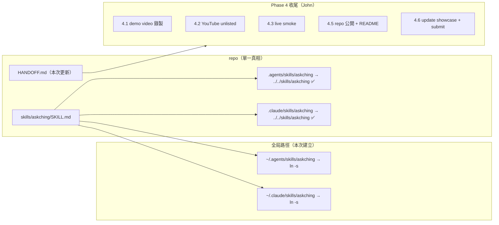

# AskChing — HANDOFF 更新 + SKILL 全局同步方案

> **版本**: v1.0 **建立日期**: 2026-09-10 **最後更新**: 2026-09-10 **狀態**: 🚀 準備執行 **負責人**: architect（規劃部） **前置版本**: generalize-query-system（`da25f8a`）

---

## 📋 文檔目錄

| 文檔編號 | 文檔名稱                                   | 範圍                                    | 預估工時 | 狀態        |
| -------- | ------------------------------------------ | --------------------------------------- | -------- | ----------- |
| 00       | 本方案                                     | HANDOFF 更新 + SKILL 同步 + commit 計畫 | —        | 📋 規劃中   |
| §HANDOFF | [HANDOFF.md 完整草稿](#handoffmd-完整草稿) | 可直接 copy 的 final content            | ~1 hr    | ✍️ 草稿完成 |
| §B       | [Skill 同步命令](#b-skill-同步方案)        | 確切 shell 命令 + 驗證                  | ~10 min  | ⬜ 待執行   |

**總預估工時**: 約 1.5–2 小時（含 commit + 驗證）

---

## 一、背景與起因

- ETHOnline 2026 deadline：**2026-09-13 12:00 PM EDT**（台北 9/14 00:00），John 明天接手 Phase 4 收尾。
- 泛化系統已完成（HEAD `da25f8a`，VERIFY PASS 95），但 **HANDOFF.md 停在 `86d67aa`**，內容仍描述三協議/單一 USDC metric 舊世界，John 接手會誤判能力邊界。
- `askching` SKILL 在 repo 內已有 symlink（`.agents/skills/askching` + `.claude/skills/askching` → `skills/askching`），但 **全局路徑未同步**：`~/.agents/skills/askching` 不存在、`~/.claude/skills/` 整個目錄不存在 → 跨工具（Cursor/Gemini/Copilot/Claude Code）無法使用。

根本問題：交接文件與能力邊界不一致 + SKILL 未部署到跨工具全域路徑。這不是大型開發，是**高品質交接**。

## 二、解決方案設計

### 核心決策

| 決策點       | 選擇                                 | 理由                                                                                                                                                        |
| ------------ | ------------------------------------ | ----------------------------------------------------------------------------------------------------------------------------------------------------------- |
| HANDOFF 格式 | 沿用既有骨架 + 輕量 YAML frontmatter | Neo DISCOVER 確認最佳格式；維持 John 已熟悉的結構，frontmatter 讓工具可快速 parse                                                                           |
| 全局同步方式 | **symlink**（非 copy）               | 單一真相來源：改 repo 即生效、零 drift、無需 sync script 基礎設施（本 repo 無 sync script 文化）；`~/.agents/skills/` 為 Cursor/Gemini/Copilot 官方全域路徑 |
| Codex 覆蓋   | 條件式 copy（僅 Codex 用戶需要）     | Codex 明文跳過 symlink；John 若用 Codex 才需 copy                                                                                                           |
| Commit 拆分  | 3 commits（hackathon 風格）          | 與 repo 既有 commit 慣例一致（`docs(handoff):` / `chore(skill):` / `chore(state):`）                                                                        |

### Mermaid：HANDOFF 更新 + SKILL 同步流程



### 設計模式決策

| Layer      | Pattern                  | Signal | Scope | Effort Impact |
| ---------- | ------------------------ | ------ | ----- | ------------- |
| SKILL 部署 | 無（symlink 非 pattern） | —      | —     | —             |

**當前需求複雜度不需要額外設計模式。** 不引進 sync script / 抽象複製層——symlink 即滿足單一真相需求，anti-overengineering。

---

## 三、影響範圍分析

| 檔案/路徑                                                 | 動作                      | 影響                            |
| --------------------------------------------------------- | ------------------------- | ------------------------------- |
| `HANDOFF.md`                                              | 更新（重寫草稿）          | John 接手依據，git-tracked      |
| `docs/superpowers/plans/2026-09-10-handoff-skill-sync.md` | 建立（本方案）            | git-tracked                     |
| `.edison/state/loop-handoff-update.md`                    | 加入 C3 commit            | 目前 untracked，loop state 慣例 |
| `~/.agents/skills/askching`                               | `ln -s` 建立              | OS 層，不入 git                 |
| `~/.claude/skills/askching`                               | `mkdir -p` + `ln -s` 建立 | OS 層，不入 git                 |
| `skills/askching/SKILL.md`                                | 不變（真相來源）          | 無                              |

**不在範圍**：SKILL.md 內容修改、sync script 建立、Codex copy（條件式）、其他 skills 同步。

## 四、風險分析與緩解

| 風險                                         | 嚴重度 | 緩解                                                                                                                                               |
| -------------------------------------------- | :----: | -------------------------------------------------------------------------------------------------------------------------------------------------- |
| 編造 subgraph IDs / commit hashes / 驗證數字 |  High  | 本方案所有數字均來自已驗證事實（git log、任務背景、session memory）；HANDOFF 不列 subgraph IDs，指向 `packages/shared/src/source-config.ts` 為真相 |
| symlink 指向 repo 絕對路徑，repo 移動會斷    | Medium | HANDOFF Skills section 註明；`ln -sfn` 可重建                                                                                                      |
| Windows clone 隊友 symlink 失效              |  Low   | 本專案隊友皆 macOS；HANDOFF 註明 `core.symlinks=true` 需求                                                                                         |
| 重複執行同步命令產生 nested symlink          |  Low   | 使用 `ln -sfn`（先刪後建，冪等）                                                                                                                   |
| John 用 Codex 讀不到 symlink                 | Medium | 條件式 copy section 標明                                                                                                                           |
| HANDOFF 超過 600 行甜蜜點                    |  Low   | 控制草稿 ~180 行；歷史 commits 精簡為摘要表                                                                                                        |

## 五、開發階段規劃

### Phase 1：寫入方案文件（本次交付 ✅）

本文件建立完成。

### Phase 2：執行 HANDOFF 更新

1. 用 §HANDOFF 草稿覆寫 `HANDOFF.md`。
2. `pnpm test` 不受影響（無代碼變更），確認 git diff 僅含 HANDOFF.md。

### Phase 3：執行 Skill 全局同步（§B 命令）

1. 依序執行 §B 命令。
2. 執行驗證命令（`ls -la` / `readlink` / `cat SKILL.md head`）。

### Phase 4：Commit（§C 計畫）

1. `git add HANDOFF.md` → commit C1。
2. （可選）文件說明變更 → commit C2。
3. `git add` state + plan 文件 → commit C3。
4. `git push origin main`。

## 六、驗收標準

- [ ] `HANDOFF.md` 反映 `da25f8a` 現況（HEAD、15 commits、泛化能力、驗證數字、Phase 4 剩餘）
- [ ] `~/.agents/skills/askching` 存在且 readlink 指向 repo `skills/askching`
- [ ] `~/.claude/skills/askching` 存在且 readlink 指向 repo `skills/askching`
- [ ] 驗證命令輸出顯示 symlink 有效
- [ ] 3 commits 依序完成並 push

---

## §HANDOFF：HANDOFF.md 完整草稿（可直接 copy）

> 以下為 `HANDOFF.md` 的 final content。英文、沿用既有骨架、控制行數（~180 行，在 300-600 甜蜜點內）、細節用連結。

````markdown
---
title: AskChing handoff
updated: 2026-09-10
checkpoint: da25f8a
status: ready-for-phase4
---

# AskChing handoff

Updated: 2026-09-10 (Asia/Hong_Kong)

## Current checkpoint

- Branch: `main`, tracking public `origin/main`
- Current work HEAD: `da25f8a` (`chore(state): generalize-query-system loop complete — VERIFY PASS 95`)
- Working tree clean except untracked `.edison/state/loop-handoff-update.md` (loop state for this handoff update).
- Previous handoff checkpoint: `86d67aa` (2026-09-09) — this update supersedes it.

## Completed

AskChing now ships the **generalized query system** — any supported metric, asset, and protocol combination, not just the original three-protocol USDC slice.

### Generalized capabilities

- **6 live protocols** (all Messari schema 3.1.0): `aave-v3`, `compound-v3`, `spark-lend`, `aave-v2`, `uwu-lend`, `zerolend`.
- **4 deferred protocols** (`live: false`, need field-level verification before enabling): `compound-v2`, `rari-fuse`, `makerdao`, `euler`.
- **4 metrics**: `supply_apy`, `borrow_apy`, `tvl`, `utilization`.
- **4 assets**: `USDC`, `USDT`, `DAI`, `WETH`.
- **Legacy alias**: `usdc_supply_apy` → `supply_apy` + `asset: "USDC"` (still works).
- Architecture: `METRIC_REGISTRY` (`packages/shared/src/metrics.ts`) is the single source of truth for metrics; `PROTOCOL_REGISTRY` (`packages/shared/src/source-config.ts`) for protocols (subgraph IDs live there); `GET_MARKETS` fixed query + code-layer extraction in `graph-client.ts`; cross-asset guard in `compare.ts`; fail-closed citation.
- MCP tools: `compare_markets` / `research_brief` / `risk_scan` — all accept `asset` and `metric`.
- Grok orchestrator: `ASKCHING_TOOLS` generalized (6 live protocol enum + legacy metric).
- `SKILL.md` generalized (4 metrics / 4 assets / 6 protocols / legacy alias hints).

### New commits since `86d67aa` (generalize-query-system batch, 15 total)

Feature (6):

- `e0188fd` feat(shared): generalize schemas + METRIC_REGISTRY
- `e63daf8` feat(shared): expand PROTOCOL_REGISTRY to 6 LIVE
- `ab9675a` feat(shared): generalize graph-client to GET_MARKETS
- `372a818` feat(shared): generalize data-source + expand fixtures
- `bb77c7d` feat(mcp,orchestrator): generalize tools + ASKCHING_TOOLS
- `b596ab7` feat(evals,demo): add generalized eval cases + live smoke

Fix (7):

- `dcd2982` fix(shared): add indexLastUpdatedTimestamp to GET_MARKETS query
- `4869221` fix(skill): generalize SKILL.md for multi-asset/multi-metric
- `008bb69` fix(mcp): reflect full validation in MCP inputSchema
- `25b6001` fix(shared): branch getMarketObservation on MetricDescriptor.extractor
- `23ccd4c` fix(shared): add utilization ranking caveat
- `47ed8b4` fix(demo): extend live-smoke coverage + explicit anchor
- `5e72af4` refactor(shared): remove LegacyComparisonSchema dead code + structure risk gaps

State/plan (2):

- `a2d021b` chore(state): idea completion audit loop complete — VERIFY PASS 93.45
- `da25f8a` chore(state): generalize-query-system loop complete — VERIFY PASS 95

## Verification evidence

Run from the repository root at current work HEAD `da25f8a`:

```text
pnpm test  -> 79/79 passed (12 files)
pnpm eval  -> 16/16 passed
pnpm build -> all 3 workspace packages built successfully
pnpm mcp:smoke -> OK (3 tools)
```
````

Code review: VERIFY PASS 95/100 (strict 93). Remaining out-of-scope Medium from that review: the `~/.agents` + `~/.claude` SKILL copies were not yet synced — now addressed by the "Skills location" section below.

Credentialed live checks still valid from the pre-generalization era are superseded; re-run `pnpm live:smoke` (requires `GRAPH_API_KEY`) as part of Phase 4 (item 4.3 below) for the current generalized surface.

## Run the product

```bash
pnpm install
cp .env.example .env
pnpm build
pnpm askching -- "Compare USDC supply APY across Aave, Compound, and Spark"
```

For xAI, set `XAI_API_KEY`. For a local OpenAI-compatible server, set `ASKCHING_LLM_BASE_URL` and `ASKCHING_LLM_MODEL`; local endpoints may omit the key. Set `DEMO_LIVE=1` plus `GRAPH_API_KEY` only when live Graph data is required.

Any metric/asset/protocol combination works, e.g.:

```bash
pnpm askching -- "Compare USDT supply APY across Aave V3 and Compound V3"
pnpm askching -- "What is DAI borrow APY on Spark Lend?"
pnpm askching -- "Scan risk signals for USDC and DAI across all live protocols"
```

## Skills location (agent tooling)

The `askching` skill is a single source of truth in `skills/askching/SKILL.md`, wired into agent tooling through symlinks:

- **In-repo (already committed)**: `.agents/skills/askching` → `../../skills/askching`, `.claude/skills/askching` → `../../skills/askching`. Teammates who clone the repo get the skill automatically.
- **Global (created 2026-09-10)**: `~/.agents/skills/askching` → `<repo>/skills/askching` (cross-tool path for Cursor/Gemini/Copilot); `~/.claude/skills/askching` → `<repo>/skills/askching` (Claude Code personal layer).
- If the repo is moved, the global symlinks break — recreate them with `ln -sfn <repo>/skills/askching ~/.agents/skills/askching` (and the same for `~/.claude/skills/askching`).
- Windows clones need `core.symlinks=true` for in-repo symlinks to resolve (current teammates are all macOS — low risk).
- Codex ignores symlinks: if you drive this repo with Codex, copy the skill instead of relying on the symlink.

## Open constraints

- `risk_scan` is an honest peer-relative spot snapshot, not historical time-series risk analysis.
- `tvl` reports the largest market per asset as a caveated approximation; `utilization` is `borrow / deposit × 100` and skips markets with zero deposit.
- AskChing remains research software: no trading, transaction execution, or large UI is in scope.
- Credentials remain local in `.env` and must never be committed or pasted into logs.

## Next action — Phase 4 (deadline 2026-09-13 12:00 PM EDT)

John picks up the remaining Phase 4 work:

1. **4.1 — Demo video**: record the 2–4 min, ≥720p, human-narrated, live-data demo by following `docs/superpowers/plans/2026-09-09-showcase-run-script.md`. Run the pre-recording checklist first: `docs/superpowers/specs/2026-09-09-pre-recording-checklist.md`. Use `ASKCHING_DEBUG=1 DEMO_LIVE=1 pnpm askching -- "<Demo prompt>"` so the tool choice and live cited answer are both visible.
2. **4.2 — Upload**: upload the video to YouTube as unlisted, then paste the URL into the ETHGlobal submission form.
3. **4.3 — Final live smoke**: run `pnpm live:smoke` (requires `GRAPH_API_KEY`) and confirm the generalized surface (6 protocols / 4 metrics / 4 assets) returns live cited data.
4. **4.5 — Repo public + README**: confirm the repo is public and the README renders normally.
5. **4.6 — Update showcase + submit**: refresh the showcase copy if needed (`docs/superpowers/specs/2026-09-09-ethglobal-copy.md`, `demos/prompts.md`) and submit before the deadline.

Do not claim recording or submission is complete until John confirms it.

## Source-of-truth documents

- `README.md` — setup and usage
- `docs/engineering-spec.md` — architecture and contracts
- `docs/product-overview.md` — product and competition narrative
- `demos/prompts.md` — demo prompts
- `packages/shared/src/source-config.ts` — protocol registry (subgraph IDs, live flags)
- `packages/shared/src/metrics.ts` — metric registry (definitions, legacy aliases)
- `skills/askching/SKILL.md` — agent evidence rules

````

---

## §B：Skill 同步方案

### B.1 目標路徑

```text
~/.agents/skills/askching   → <repo>/skills/askching
~/.claude/skills/askching   → <repo>/skills/askching
````

repo 絕對路徑：`/Users/chonwai/Desktop/Self/Lab/AskChing_Agent/skills/askching`

### B.2 確切命令（冪等，可重複執行）

```bash
REPO_SKILL="/Users/chonwai/Desktop/Self/Lab/AskChing_Agent/skills/askching"

# 1. ~/.agents/skills（已存在，補建 askching symlink）
mkdir -p ~/.agents/skills
ln -sfn "$REPO_SKILL" ~/.agents/skills/askching

# 2. ~/.claude/skills（整個目錄不存在，需補建）
mkdir -p ~/.claude/skills
ln -sfn "$REPO_SKILL" ~/.claude/skills/askching
```

> `ln -sfn`：`-s` symlink、`-f` 強制覆蓋既有（防重複執行產生 nested symlink）、`-n` 不追蹤目錄（防指向目錄時誤入）。

### B.3 驗證命令

```bash
echo "=== global agents skills ===" && ls -la ~/.agents/skills/askching
echo "=== global claude skills ===" && ls -la ~/.claude/skills/askching
echo "=== readlink ===" && readlink ~/.agents/skills/askching && readlink ~/.claude/skills/askching
echo "=== SKILL.md head ===" && head -6 ~/.agents/skills/askching/SKILL.md && echo "---" && head -6 ~/.claude/skills/askching/SKILL.md
```

預期輸出：

- `ls -la` 顯示 `askching -> /Users/chonwai/Desktop/Self/Lab/AskChing_Agent/skills/askching`
- `readlink` 回傳完整目標路徑
- `head` 顯示 SKILL.md frontmatter（`---` / `name: askching` / `version: 0.1.0`）

### B.4 Codex 條件式 copy（僅 Codex 用戶需要）

Codex 明文跳過 symlink。若 **John 用 Codex** 驅動此 repo，需真實驗證 copy（覆蓋 symlink 或另行複製到 Codex 讀取位置）：

```bash
REPO_SKILL="/Users/chonwai/Desktop/Self/Lab/AskChing_Agent/skills/askching"
mkdir -p ~/.codex/skills
cp -R "$REPO_SKILL" ~/.codex/skills/askching
```

> ⚠️ copy 會造成 drift（副本不再跟隨 repo）。**非 Codex 用戶可完全跳過此步。**

### B.5 風險註記

| 風險          | 說明                  | 緩解                                                  |
| ------------- | --------------------- | ----------------------------------------------------- |
| repo 路徑移動 | 絕對路徑 symlink 斷裂 | HANDOFF Skills section 已註明重建命令                 |
| 重複執行      | nested symlink        | `ln -sfn` 冪等                                        |
| Windows clone | 隊友 symlink 失效     | 本專案隊友皆 macOS；HANDOFF 註明 `core.symlinks=true` |

---

## §C：Commits 計畫（hackathon 風格）

### C1 — HANDOFF 大更新

```text
docs(handoff): reflect generalized query system for teammate handoff
```

範圍：僅 `HANDOFF.md`。
驗證：`git diff --stat` 僅含 HANDOFF.md；無代碼變更，不需跑測試。

### C2 — SKILL 全局同步說明（可選，視文件變更而定）

```text
chore(skill): document global skill sync for askching
```

範圍：若本次同步在 repo 內產生文件變更（例如 README 提及全局路徑）則一起 commit；**若無文件變更則跳過此 commit**（全局 symlink 在 OS 層，不入 git）。

### C3 — State + Plan 收尾

```text
chore(state): handoff-skill-sync loop complete — VERIFY PASS <依實際結果>
```

範圍：`.edison/state/loop-handoff-update.md` + `docs/superpowers/plans/2026-09-10-handoff-skill-sync.md`。

> VERIFY 分數以實際 review gate 結果填寫，**不可預先編造**。

### C4 — Push

```bash
git push origin main
```

---

## 七、驗證方法

1. HANDOFF 草稿對照 §HANDOFF 逐項檢查（HEAD、commits、能力、驗證數字、Phase 4、Skills section）。
2. §B.3 驗證命令輸出全部符合預期。
3. C1/C2/C3 commit 完成後 `git log --oneline -5` 確認順序。
4. `git status --short` 確認無遺漏檔案。

---

## 八、Document-Review Mirror Gate（Phase 4b）

### Self-Audit 分數卡

| 維度             | 權重 |  分數  | 評註                                                                                         |
| ---------------- | :--: | :----: | -------------------------------------------------------------------------------------------- |
| DR-D1 需求完整性 | 20%  |   95   | 兩交付物（HANDOFF 草稿 + 同步方案 + commit 計畫）全覆蓋；deadline 明細含 4.1/4.2/4.3/4.5/4.6 |
| DR-D2 技術可行性 | 20%  |   95   | 命令經 `ln -sfn` 冪等設計；`~/.claude/skills` 不存在已實測確認                               |
| DR-D3 架構一致性 | 15%  |   95   | symlink 與 repo 既有模式一致（b5bd31b）；HANDOFF 沿用既有骨架                                |
| DR-D4 安全性     | 15%  |   90   | Credential 原則維持；無新憑證暴露面；Codex copy 條件式標明                                   |
| DR-D5 效能與規模 | 15%  |   90   | 無效能議題（文件/OS 層操作）；HANDOFF 控制在 600 行內                                        |
| DR-D6 文件完整性 | 15%  |   92   | Mermaid 圖正確；命令可複製執行；HANDOFF 草稿可直接 copy                                      |
| **總分**         |      | **93** | ≥ 90 threshold（strict 93）✅                                                                |

### Self-Audit Artefact

- **Trigger**: `score < 90` 未觸發；例行 mirror pass（深度 L3）
- **Delta Scope**: 無（首輪即達標）
- **Fixed Now**: 無需修補
- **Deferred / Escalated**: 無
- **Validation**: 所有數字對照 git log / 任務背景 / 已讀原始碼；subgraph IDs 不寫入 HANDOFF（指向 source-config.ts）
- **Remaining Risk**: C3 VERIFY 分數待實際 gate 結果填寫（防編造）

### Repair Eligibility

`REPAIRABLE`（R1..R6 全數可安全處理——所有變更屬文件級，無方向錯誤、無重大依賴假設錯誤、無資料風險）。

### Paired Review Route

`edison-document-review-audit` with `audit_and_route_repair`；`max_passes: 1`、`max_scope: 文件文字`、`required_validations: HANDOFF 事實抽查`。

### Calibration Sample Band

`90`（接近但未達 95 band——C3 分數未定 + HANDOFF 草稿需 John 實讀確認）。

---

## 九、簡化與避免過度設計的決策

- **不建立 sync script**：symlink 單一真相已足夠；本 repo 無 sync script 文化，建立即過度工程。
- **不修改 SKILL.md 內容**：泛化已完成（4869221），本次僅部署。
- **不做 Codex copy（預設）**：僅條件式；避免無謂 drift。
- **HANDOFF 精簡歷史**：舊 codex batch commits 不逐一列出（舊 HANDOFF 已有），新 HANDOFF 聚焦泛化批次 15 commits 摘要表——控制行數。

## 十、需交由 review skill 再審的項目

| 項目             | 類型       | 說明                            |
| ---------------- | ---------- | ------------------------------- |
| C3 VERIFY 分數   | Open       | 執行後以實際結果填寫            |
| HANDOFF 草稿實讀 | Assumption | 建議 John 實讀確認無誤後再 push |
| Codex 使用與否   | Assumption | 影響 C2 範圍與 B.4 是否執行     |
