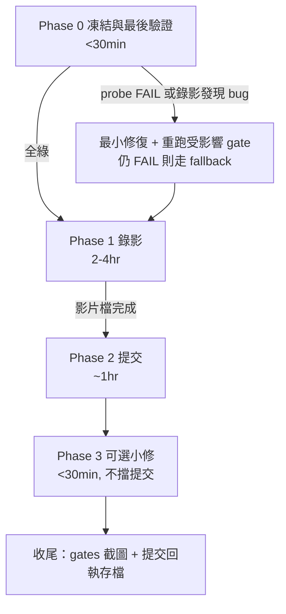

# ETHOnline 2026 比賽收尾執行計畫 — AskChing_Agent

> 起點：HEAD `24f7b34`（`main`，與 `origin/main` 同步，0 commits ahead，working tree 預期 clean）
> Deadline：2026-09-13 12:00 PM EDT = **台北 9/14（一）00:00**，剩餘約 28h
> Track：The Graph — Best AI Tooling or AI Use Case (From Scratch)，$5K
> 依據：morpheus DISCOVER 結論（信賴，不重驗）+ `docs/superpowers/plans/2026-09-12-demo-narrative.md` + codebase 實測（`windowKey` / `utcDayStart` 已讀檔確認）
> 深度：L3、strict

---

## 1. 需求理解確認

根本問題不是「再多做功能」，而是「在 28h 內把已完成的 6-tool + 4 lending + 2 DEX 系統變成可提交、可評審的參賽件」。評審只看：影片（2-4 min、≥720p、真人配音、live data）+ repo + live endpoint。任何改 code 的動作都是風險，只有 probe 失敗或錄影發現 bug 才解凍。

成功標準：影片上傳完成即提交成功；gates 全綠截圖留存；提交後工作樹與提交物一致。

明確不做（morpheus §5 背書)：換鏈擴展（Base/Arbitrum/Polygon）、Uniswap pools / Curve snapshots 分頁（`first: 100` / `first: 1000` caps）、任何重構。

---

## 2. 程式庫現狀分析（Codebase Baseline）

| 項目 | 現狀（已驗證） |
|---|---|
| MCP tools | 6 個，單一註冊源 `packages/mcp-server/src/register.ts`：`compare_markets` / `research_brief` / `risk_scan` / `analyze_markets` / `analyze_trends` / `discover_yields`；stdio + Streamable HTTP 雙傳輸 |
| Live lending | 4 個（`aave-v3` / `compound-v3` / `spark-lend` / `aave-v2`），`pnpm probe:protocols` 4/4 |
| Live DEX | 2 個（`uniswap-v3` `4cKy6Q…` / `curve` `3fy93e…`，皆 Messari schema），`pnpm probe:yields` 2/2；Uniswap 用 two-phase lookup（pools → per-pool `where:{pool}`）避開 global snapshot timeout |
| Gates（HEAD） | `build` 3/3、`test` 209/209（21 files）、`eval` 27/27、`mcp:smoke` 6、`mcp:http:smoke` 6、`vercel:probe` OK、`probe:protocols` 4/4、`probe:yields` 2/2、`git diff --check` clean |
| Demo 資產 | `docs/superpowers/plans/2026-09-12-demo-narrative.md`（3 Wow + shot list + fallback）、`demos/prompts.md`、`demos/demo.ts` / `live-smoke.ts` |
| 協作狀態 | johnku 近 5 commits 為收尾性質（probe lint + adapter UTC-day 歸一化 + docs 對齊），與本地修復互補無衝突；已推送至 `24f7b34` |

已知風險（morpheus 遺留，全部承接）：

| # | 風險 | 等級 | 對策所在 Phase |
|---|---|---|---|
| R1 | DEX probe flakiness：gateway 暫態抖動，首次 0/2 FAIL、重跑 2/2 OK | 🔴 | Phase 0 重跑判讀 + Phase 1 開錄前 5 分鐘重跑 + fallback |
| R2 | HANDOFF checkpoint 落後（`da2b40c` vs HEAD `24f7b34`） | 🟡 | Phase 3 可選小修，不擋提交 |
| R3 | `windowKey` 用 `Math.round` vs adapter 用 `Math.floor`（latent inconsistency，目前無觸發） | 🟡 | Phase 3 可選小修，不擋提交 |

R3 精確位置（已讀檔確認）：

- `packages/shared/src/yield-discovery.ts:216-221` — `windowKey()` 用 `Math.round(Date.parse(value.windowStart) / DAY_MS)` 做 UTC-day bucketing
- `packages/shared/src/yield-client.ts:413` — `utcDayStart()` 用 `Math.floor(timestamp / 86_400) * 86_400` 做 citation window 歸一化
- 兩者目前因 adapter 輸出已是整 UTC 天起始而無觸發；邊界秒級偏移（23:59:59.6+）才可能分桶不一致

---

## 3. 解決方案設計 + 流程圖

策略：**凍結 → 錄影 → 提交 → 可選小修**。錄影是 critical path，提交緊隨影片完成，不等可選小修。



---

## 4. Phase 0 — 凍結與最後驗證（<30 min）

**規則：從此刻起凍結代碼。除非本 Phase probe 失敗或 Phase 1 錄影發現 bug，否則不碰 `packages/`、`api/`、`demos/`、`evals/`。**

### 4.1 執行清單（依序，一次跑完）

```bash
git status -sb
git log --oneline -3
git diff --check

pnpm build
pnpm test
pnpm eval
pnpm mcp:smoke
pnpm mcp:http:smoke
pnpm vercel:probe
pnpm probe:protocols
pnpm probe:yields
# 若 probe:yields 或 probe:protocols 出現 0/2 或部分 FAIL：等 2 分鐘重跑一次再判讀（R1）
pnpm probe:yields
pnpm probe:protocols
```

### 4.2 預期結果（任一不符即停，不進 Phase 1）

| Gate | 預期 |
|---|---|
| `git status -sb` | clean（除 `.env` 未追蹤外無修改） |
| `pnpm build` | 3/3 packages |
| `pnpm test` | 209/209（21 files） |
| `pnpm eval` | 27/27 |
| `pnpm mcp:smoke` | 6 tools |
| `pnpm mcp:http:smoke` | 6 tools |
| `pnpm vercel:probe` | OK |
| `pnpm probe:protocols` | 4/4 live |
| `pnpm probe:yields` | 2/2 live DEX venues |
| `git diff --check` | clean（無 whitespace error） |

### 4.3 判讀規則

- 全部一次全綠 → 直接進 Phase 1。
- `probe:protocols` / `probe:yields` 首次 FAIL、重跑 PASS → 視為 R1 暫態抖動，記錄時間點，進 Phase 1（錄影前仍要再跑一次）。
- 連續兩次 FAIL → 解凍排查（只看該 probe 對應 adapter，不動其他檔案），修完只重跑受影響 gate + `pnpm test`。
- `test` / `eval` / `build` 任一 FAIL → 不進 Phase 1，先修。

---

## 5. Phase 1 — 錄影（2-4 hr，最高優先）

### 5.1 關鍵 beats（依 `2026-09-12-demo-narrative.md`，已更新為 6-tool + DEX 現狀）

> 注意：原 narrative 寫於 5-tool 時期，shot list 中「5 個工具」一律改為 **6 個**；W3 後追加 **DEX beat**（`discover_yields` + `crossDexWinner`）。總長目標 3:10，上限 4:00。

| Beat | 時間 | 畫面 + 口白要點 |
|---|---|---|
| 開場定位 | 0:00-0:20 | 痛點：「沒有來源、沒有時間、沒有區塊高度的數字等於零」；報定位金句「graph-lending-mcp 讓你問得到，AskChing 讓你信得過」 |
| 我們是什麼 | 0:20-0:45 | `curl <app>/api/health` → `live:true`；強調遠端 MCP server、一行 URL、7 平台 |
| Q1 + citation | 0:45-1:15 | Claude Desktop 問 USDC supply APY（Aave V3 / Compound V3 / Spark Lend）；指 ranked + subgraph ID + block + query hash + asOf |
| 🎯 W1 換平台 | 1:15-1:50 | VS Code Copilot 問完全同一題，證據結構一致；terminal `gemini mcp list` → Connected + 6 tools |
| 🎯 W2 拒絕回答 | 1:50-2:20 | `ASKCHING_DEBUG=1 pnpm askching -- "Compare USDC supply APY on Aave V3 only"` → fail-closed（需 ≥2 cited sources，不給 row）；字幕 `Evidence is a structural invariant, not a display option.` |
| 🎯 W3 時間維度 | 2:20-2:55 | `analyze_trends` 7d（slope / direction / volatility，每點 block+timestamp）；再示範 spot-only objective + 歷史窗 → explicit gap |
| ➕ DEX beat（新增） | 2:55-3:20 | `ASKCHING_DEBUG=1 DEMO_LIVE=1 pnpm askching -- "Where can I earn yield on USDC across lending, Uniswap V3, and Curve?"` → lending/LP 分開排名 + 公式 + `crossDexWinner`（Uniswap V3 DAI/USDC `0x5777d92f…` 歷史 fee APR）+ risk flags；強調 citation window 皆為同一 UTC 天 |
| 收尾 | 3:20-3:35 | 「The Graph 提供不可變、可驗證的鏈上歷史；AskChing 把它變成 AI 敢引用、也敢承認不知道的研究報告」；字卡 repo URL + endpoint |

### 5.2 開錄前 5 分鐘 probe 重跑步驟（必做，對抗 R1）

```bash
# 1) endpoint 是 live（錄到畫面裡）
curl -s https://<app>.vercel.app/api/health
# 預期：transport=streamable-http, live=true（若為 false，當段改口說 fixture，不假裝 live）

# 2) 6 tools 都在
curl -s https://<app>.vercel.app/api/mcp \
  -H 'Content-Type: application/json' \
  -H 'Accept: application/json, text/event-stream' \
  -d '{"jsonrpc":"2.0","id":1,"method":"tools/list","params":{}}' | jq '.result.tools | length'
# 預期：6

# 3) lending + DEX 同時活著（各跑一次；FAIL 等 2 分鐘重跑一次）
pnpm probe:protocols
pnpm probe:yields
# 預期：4/4 + 2/2

# 4) 預熱（避 cold start）+ 預錄 crossDexWinner 一次確認今日仍有共同 UTC 天
curl -s https://<app>.vercel.app/api/mcp -H 'Content-Type: application/json' \
  -H 'Accept: application/json, text/event-stream' \
  -d '{"jsonrpc":"2.0","id":1,"method":"tools/list","params":{}}' > /dev/null
ASKCHING_DEBUG=1 DEMO_LIVE=1 pnpm askching -- "Where can I earn yield on USDC across lending, Uniswap V3, and Curve? Cite every source."
# 預期：出現 crossDexWinner + lending/LP 分開排名；若無共同天而 fail-closed，屬正常語義，錄影時如實念出 gap 文案
```

### 5.3 Live data 準備

- 全程 `DEMO_LIVE=1` + `.env` 內 `GRAPH_API_KEY`（錄影前檢查 terminal 不洩 key、不錄 URL bar 的 key query）。
- `crossDexWinner` 展示：用 5.2 步驟 4 的同一問句；若當次無共同天，**不要重錄造假**，直接用 fail-closed 文案當「誠實缺口」第二例。
- 錄影禁語：不說「預測」「建議買入」；不炫耀「90 協議」；Gemini CLI 的 `mcp_askching_*` 命名空間不要說成我方 API 名。

### 5.4 Fallback（沿用 narrative §5，錄影當下直接切，不停機排查）

| 若… | 改用 |
|---|---|
| Grok Bot connectors 不可用 | 跳過，W1 用 VS Code + Cursor 即可成立 |
| Live Graph 查詢失敗（連續兩次 probe FAIL） | 該段改 `DEMO_LIVE=0` fixture 並口頭說明是 fixture；絕不假裝 live |
| Claude Desktop 不支援 remote | 用 `docs/platform-integration.md` §10 的 `mcp-remote` 橋接 |
| 網路不穩 | 用 5.2 預錄的 curl 文字檔 + 已錄備份段 |
| 時間不足 | **保 W2（fail-closed）**，其餘可剪 |

---

## 6. Phase 2 — 提交（~1 hr，影片完成即交）

### 6.1 提交前 checklist（逐項勾）

- [ ] 影片：2-4 min、≥720p、真人配音、有 live data 畫面、無 API key 入鏡
- [ ] Track 選對：The Graph — Best AI Tooling or AI Use Case (From Scratch)，不勾 Continuity
- [ ] Repo URL 可公開訪問；`README.md` 有 endpoint + 6 tools + 4+2 live 說明
- [ ] Gates 截圖留存（`build` / `test` 209 / `eval` 27 / 兩 smoke 6 / `vercel:probe` OK / `probe:protocols` 4/4 / `probe:yields` 2/2）
- [ ] 提交表單的 project description 含三句：evidence-first 定位、6 tools 雙傳輸、fail-closed + 趨勢 + DEX 發現
- [ ] 按下 Submit 後存回執（截圖 + 確認信）；回執存檔後才做 Phase 3

### 6.2 提交文案底稿（貼上即用，可微調）

> AskChing is an evidence-first AI research layer over The Graph. One remote MCP server (6 tools, stdio + Streamable HTTP) serves Claude, Cursor, VS Code, Codex, Gemini, and Grok Bot from a single URL. Every number carries subgraph ID, block, timestamp, and query hash; fewer than 2 cited sources fails closed instead of hallucinating. It covers 4 live lending protocols and 2 live DEX venues (Uniswap V3 + Curve) with 7d/30d cited trends and cross-venue USDC yield discovery. graph-lending-mcp lets you ask; AskChing lets you trust.

---

## 7. Phase 3 — 可選小修（<30 min，提交後才做，不擋提交）

只做以下三項，任一擴大範圍即停。做完重跑受影響 gate；若引入任何 FAIL，`git revert` 回提交狀態。

| # | 修復項（精確到檔案/行為） | 操作 |
|---|---|---|
| F1 | `HANDOFF.md` checkpoint 落後（`da2b40c` → `24f7b34` + 後續） | 更新 `checkpoint:`、`status:`、`Current checkpoint` 三處；`git log --oneline` 核對；只動 `HANDOFF.md` |
| F2 | `packages/shared/src/yield-discovery.ts:216-221` `windowKey` `Math.round` → `Math.floor`，與 `packages/shared/src/yield-client.ts:413` `utcDayStart` 一致 | 單行改動；重跑 `pnpm test` + `pnpm eval` + `pnpm probe:yields`；若 DEX 行為變化超出預期則 revert |
| F3 | correction log 註記 | 在 `HANDOFF.md` §Corrections 追加 R1 抖動記錄 + F2 統一記錄（一句話各一）；只動 `HANDOFF.md` |