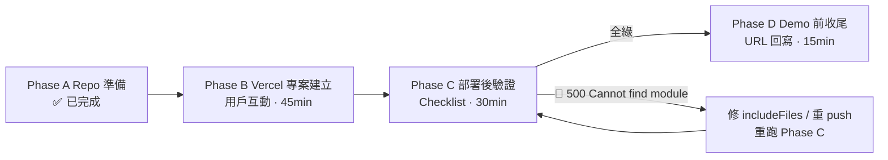

# Vercel 部署執行計畫 — AskChing_Agent（deep / strict）

> 起點：HEAD（main，與 origin/main 同步）｜Deadline：2026-09-13 12:00 PM EDT = **台北 9/14 00:00（就是今天）**
> 依據：morpheus DISCOVER + smith strict review（92/100 REPAIRABLE，H1+M1 已修）+ docs/deployment-vercel.md
> 總預算：~2 小時完成部署＋驗證

## 1. 需求理解確認

根本問題不是「再寫功能」，而是「在 deadline 前把已 6-tool 的系統放上公開可連的遠端 MCP endpoint，並驗證法官真的連得上」。**零代碼變動**（`packages/`、`api/`、`demos/`、`evals/` 凍結）；只動 config + docs。

成功標準：
1. `https://<app>.vercel.app/api/health` → 200，mode 顯示 live（Production）
2. `/api/mcp` 與 `/mcp` 的 `tools/list` 都回 **6 個工具**
3. `tools/call compare_markets` → `isError:false` + citations
4. `analyze_trends` 30d live 在 Function timeout 內完成（或得到明確 gap）
5. README / HANDOFF 寫入真實 URL；提交前 gates 全綠

明確不做：Fluid compute 不預設開（有徵兆才開）、auth/rate-limit 不加（hackathon 取捨）、不重構。

---

## 2. 現況 Baseline（已驗證）

| 項目 | 現狀 |
|---|---|
| MCP tools | 6 個（register.ts 單一註冊源） |
| vercel.json | ✅ 無 `framework`（正確 = 自動偵測 Other）；build/install/output/includeFiles/maxDuration 全正確 |
| api/mcp.ts | ✅ `export default { fetch }` + runtime nodejs + maxDuration 60 |
| api/health.ts | ✅ 免憑證回 mode |
| docs/deployment-vercel.md | ✅ 已修 H1（framework 警示）+ M1（5→6 tools） |
| GitHub remote | ✅ origin/main 可 push 觸發自動 deploy |

---

## 3. 流程圖



---

## 4. Phase A — Repo 準備（✅ 已完成）

- `docs/deployment-vercel.md`：M1（5→6 tools 三處）修復 ✅（commit `b1edb10`）
- `docs/deployment-vercel.md`：H1（framework 警示）修復 ✅（commit `1a8bad3`）
- `docs/reviews/2026-09-13-vercel-deploy-research.md`：研究報告 ✅（commit `65d9168`）

**不需要再動 repo**。`vercel.json` 保持現狀（不加 framework）。

---

## 5. Phase B — Vercel 專案建立（需用戶操作）

### 前置（15 秒）

```bash
git status -sb   # clean、已 push
git remote -v    # origin 存在
```

### 方式 B-1：Dashboard（推薦）

1. https://vercel.com/new → **Continue with GitHub** → 授權（若未授權）
2. Import Git Repository → 選 **`AskChing_Agent`**
3. **Framework Preset 確認 = `Other`**（自動偵測，**不要手動改**）
4. Root Directory：**留空**（repo 根）
5. Build / Install / Output：**讓 `vercel.json` 自動帶入**（不覆寫 UI）
   - Build Command: `pnpm build`
   - Install Command: `pnpm install --frozen-lockfile`
   - Output Directory: `public`
6. Node.js Version：**22.x**
7. Environment Variables：

| Variable | Production | Preview |
|---|---|---|
| `DEMO_LIVE` | `1` | `0` |
| `GRAPH_API_KEY` | `<your key>`（low-quota） | 留空 |

> 不需要 `XAI_API_KEY`（Grok 是 CLI，不參與遠端 MCP）。

8. **Deploy** → 等 build log（~2-4 min）→ 複製 Production URL `https://<app>.vercel.app/`
9. （可選）Settings → Firewall 加 rate limit 保護 quota

### 方式 B-2：CLI（備援）

```bash
npm i -g vercel
vercel login
vercel link       # 選或建專案 → 產生 .vercel/（已在 .gitignore）
vercel env add DEMO_LIVE production     # 1
vercel env add GRAPH_API_KEY production # <key>
vercel env add DEMO_LIVE preview        # 0
vercel --prod
```

---

## 6. Phase C — 部署後驗證（Checklist）

```bash
# C1. Health（mode 應為 live）
curl -s https://<app>.vercel.app/api/health | jq .

# C2. 🔴 tools/list = 6（驗證模組打包，唯一有效方法）
curl -s -X POST https://<app>.vercel.app/api/mcp \
  -H 'Content-Type: application/json' \
  -H 'Accept: application/json, text/event-stream' \
  -d '{"jsonrpc":"2.0","id":1,"method":"tools/list","params":{}}' \
  | jq '.result.tools | length'
# 期望：6。若 500 Cannot find module → FIX 迴路（includeFiles 補 dist）

# C3. /mcp rewrite = 6
curl -s -X POST https://<app>.vercel.app/mcp \
  -H 'Content-Type: application/json' \
  -H 'Accept: application/json, text/event-stream' \
  -d '{"jsonrpc":"2.0","id":1,"method":"tools/list","params":{}}' \
  | jq '.result.tools | length'

# C4. tools/call live（citations 應存在）
curl -s -X POST https://<app>.vercel.app/api/mcp \
  -H 'Content-Type: application/json' \
  -H 'Accept: application/json, text/event-stream' \
  -d '{"jsonrpc":"2.0","id":2,"method":"tools/call","params":{"name":"compare_markets","arguments":{"metric":"supply_apy","asset":"USDC","protocols":["aave-v3","compound-v3","spark-lend"]}}}'

# C5. analyze_trends 30d（60s timeout 風險）
time curl -s -X POST https://<app>.vercel.app/api/mcp \
  -H 'Content-Type: application/json' \
  -H 'Accept: application/json, text/event-stream' \
  -d '{"jsonrpc":"2.0","id":3,"method":"tools/call","params":{"name":"analyze_trends","arguments":{"metric":"supply_apy","asset":"USDC","protocols":["aave-v3","compound-v3","spark-lend"],"window":"30d"}}}'
# 期望 < 50s；timeout → demo 用 7d

# C6. MCP Inspector（demo 截圖，5 min）
npx @modelcontextprotocol/inspector   # Transport=URL, 貼 /api/mcp

# C7. Cursor 實際連線（demo 截圖，5 min）
# Settings → MCP → Add Server → URL → https://<app>.vercel.app/api/mcp → 6 tools
```

---

## 7. Phase D — Demo 前收尾

1. **URL 回寫**（README + HANDOFF + demo narrative 的 `<app>` → 真實 URL）
2. **Fluid compute 決策**：C4/C5 出現 memory limit 或 >60s → 開；全綠 → 不開
3. **最後 gates**：build 3/3、test 209/209、eval 27/27、smoke 6、vercel:probe OK、probe:protocols 4/4、probe:yields 2/2
4. push → 自動 redeploy → 重跑 C1/C2

---

## 8. 時間表

| 時間 | Phase | 執行者 | 預估 |
|---|---|---|---|
| T0 | Phase A | ✅ 已完成（3 commits） | 0 |
| T0 | Phase B 專案建立 + env + deploy | 用戶 | 45 min |
| T0+45 | Phase C1-C5 核心驗證 | Neo / 用戶 | 20 min |
| T0+65 | Phase C6-C7 截圖 | 用戶 | 10 min |
| T0+75 | Phase D URL 回寫 + gates | Neo | 15 min |
| T0+90 | 錄影（依 finish-line 計畫） | John | critical path |

## 9. 風險緩解

| 風險 | 緩解 |
|---|---|
| `500 Cannot find module` | includeFiles 已涵蓋 dist；部署後 C2 實測 |
| lockfile 過期 | 本地 `pnpm install` 更新後 commit |
| analyze_trends 30d timeout | demo 用 7d / fixture fallback |
| DEX probe gateway 抖動 | 錄影前重跑（R1 已知） |
| 冷啟動慢 | C2 先打一次預熱 |